# Módulo 00 — Registro con subscription-manager, entitlements, instalación de RHEL 10

- Estado: Completado
- Fecha: 2026-09-28
- Versión: RHEL 10.2 (Coughlan)
- Objetivo diferencial frente a Fedora: Fedora no tiene modelo de registro —
  sus repos son públicos y gratuitos sin autenticación. RHEL es un producto
  comercial: el acceso a BaseOS/AppStream depende de un sistema registrado
  con entitlements válidos vía `subscription-manager`, aunque la cuenta sea
  gratuita (Developer Subscription for Individuals).

## Concepto diferencial

Fedora y CentOS Stream son upstream/downstream de RHEL pero no requieren
cuenta. RHEL vende soporte y garantías sobre un ciclo de vida de 10 años, y
el mecanismo para controlar el acceso a esos repos es la suscripción. Esto
no es solo burocracia: es la diferencia entre "descargué una ISO" y "tengo
acceso a paquetes parcheados, seguridad, y compatibilidad garantizada
durante una década".

**Las tres piezas de subscription-manager:**

1. **Cuenta Red Hat** (gratis vía Developer Subscription for Individuals) —
   identifica quién sos.
2. **Registro del sistema** (`subscription-manager register`) — vincula
   *esta VM en particular* a tu cuenta. Cada sistema registrado consume un
   "slot" de tu suscripción (la Developer da hasta 16).
3. **Entitlements** — certificados X.509 en `/etc/pki/entitlement/` que le
   dicen a `dnf` qué repos puede ver. Sin entitlement válido, los repos de
   Red Hat están configurados pero inaccesibles.

Con RHEL 10, **Simple Content Access (SCA)** simplificó el modelo: ya no
hace falta `attach` manual de una suscripción específica — al registrar la
cuenta, si tiene SCA habilitado (default en cuentas nuevas), los
entitlements quedan disponibles automáticamente. Esto es un cambio real
frente a versiones anteriores de RHEL donde existía `attach --auto`.

**AppStream vs BaseOS**: BaseOS es el núcleo mínimo del sistema (kernel,
systemd, utilidades base, ciclo largo). AppStream son aplicaciones,
lenguajes, bases de datos, con streams de versiones elegibles
independientemente del ciclo de BaseOS. Separación específica de RHEL 8+,
clave para el examen.

## Práctica guiada

### 1. Instalación desde la ISO

Instalación estándar en VirtualBox: 4 GB RAM, 2 vCPU, ~41 GB disco (según
la tabla del entorno del curso). Controlador gráfico `VMSVGA` (ver hallazgo
#3 sobre por qué no `VBoxSVGA`). Hostname `rhel10-server.local`, usuario
`fbeleno` con privilegios `wheel` (sudo), root deshabilitado.

### 2. Error intencional: `dnf` antes de registrar

```bash
sudo dnf repolist
```

Resultado esperado y confirmado: `No se pudo leer identidad del consumidor`
/ `No hay ningún repositorio disponible`. Los repos de RHEL vienen
preconfigurados en el `.repo` pero sin entitlement no hay nada detrás.

### 3. Registro

```bash
sudo subscription-manager register --username TU_USUARIO
```

### 4. Verificación de status y entitlements

```bash
sudo subscription-manager status
sudo subscription-manager list --installed
```

### 5. Confirmar acceso real a los repos

```bash
sudo dnf repolist
```

### 6. Bonus: Guest Additions (fuera del alcance original del módulo)

Una vez que `dnf` funciona, se instalaron las Guest Additions de
VirtualBox para resolver la resolución/mouse:

```bash
sudo dnf install -y gcc kernel-devel kernel-headers make perl elfutils-libelf-devel
# Dispositivos → Insertar imagen de CD de las Guest Additions...
sudo mkdir -p /mnt/vboxadditions
sudo mount /dev/sr0 /mnt/vboxadditions
sudo /mnt/vboxadditions/VBoxLinuxAdditions.run
```

## Hallazgos reales

1. **`subscription-manager status` ya no dice "Overall Status: Current"**.
   En RHEL 10 con SCA el output se simplificó a `Estatus general:
   Registrado` — el modelo viejo de "suscripciones actuales vs vencidas"
   ya no aplica de la misma forma porque con SCA no hay nada que "vencer"
   a nivel de attach individual.
2. **`subscription-manager list --available` y `--consumed` no existen
   más**. Son remanentes de documentación pre-SCA. Las únicas opciones
   reales de `list` en esta versión son `--installed` (default) y
   `--matches`.
3. **El controlador gráfico VMSVGA de VirtualBox genera warnings
   `vmwgfx *ERROR*` en el boot de RHEL 10**, pero son cosméticos — no
   bloquean nada. Cambiar a `VBoxSVGA` pensando que "arreglaba" el warning
   en realidad **rompió el modo gráfico de Anaconda**
   (`Wayland startup failed, falling back to text mode`). Lección:
   `VMSVGA` es la opción correcta para este guest, a pesar del ruido en el
   log.
4. **Los `kernel-headers`/`kernel-devel` instalados desde los repos no
   coincidían con el kernel de la ISO** (`211.7.3` corriendo vs `211.61.1`
   en repos) — esto rompió la primera compilación de los módulos de Guest
   Additions (`Kernel headers not found for target kernel`). Se resolvió
   con `sudo dnf update kernel -y` + `reboot`, lo cual además disparó
   automáticamente el rebuild de los módulos de Guest Additions como hook
   post-instalación del paquete `kernel`.

## Evidencias

**01 — GRUB del instalador**
Menú de GRUB del instalador de RHEL 10.2: instalación normal, test+install, FIPS, troubleshooting.
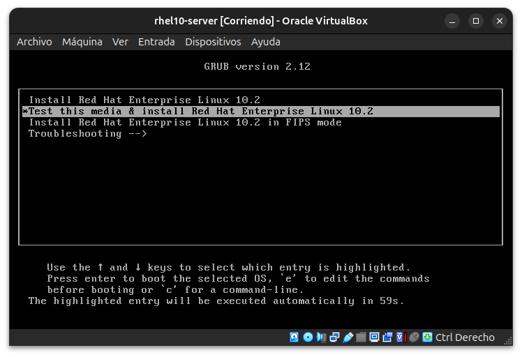

**02 — Bienvenida de Anaconda**
Primer arranque exitoso de Anaconda en modo gráfico, con VMSVGA, selección de idioma español (Colombia).
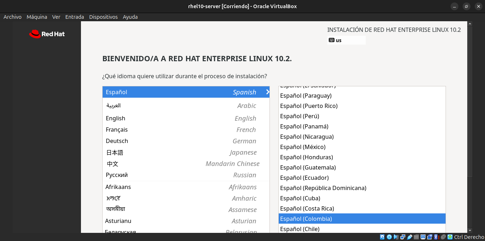

**03 — Hallazgo: VBoxSVGA rompe Wayland**
Al cambiar el controlador gráfico a VBoxSVGA, Anaconda no pudo iniciar Wayland y cayó a modo texto/RDP — evidencia del hallazgo #3.
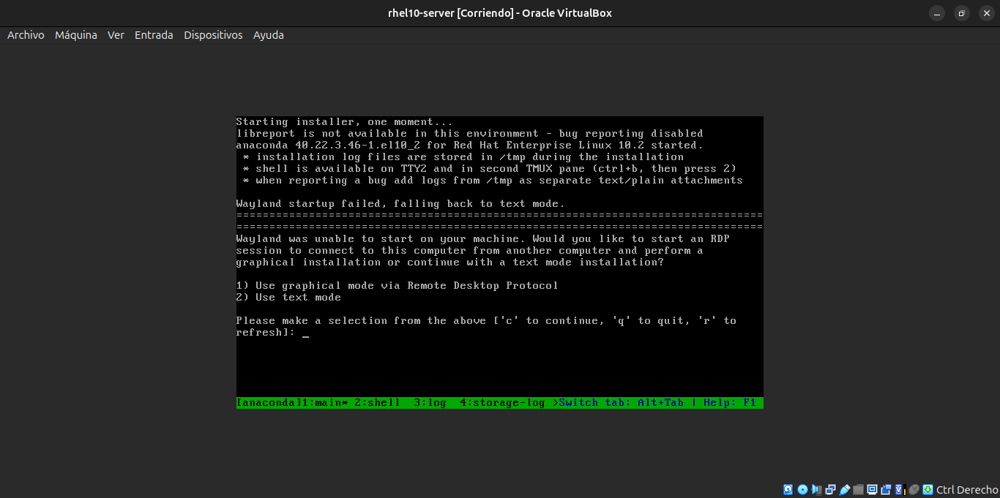

**04 — Boot con VMSVGA revertido**
Con VMSVGA de nuevo, reaparecen los warnings `vmwgfx`/`e1000` pero el boot continúa sin problema — confirma que son ruido, no errores reales.
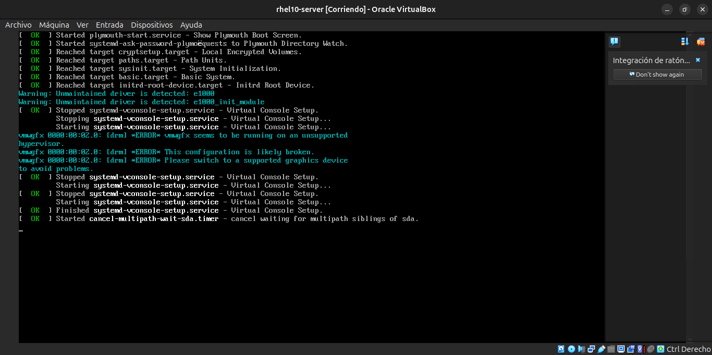

**05 — Destino de instalación**
Disco de 41.28 GiB seleccionado, particionado automático, sin cifrado.
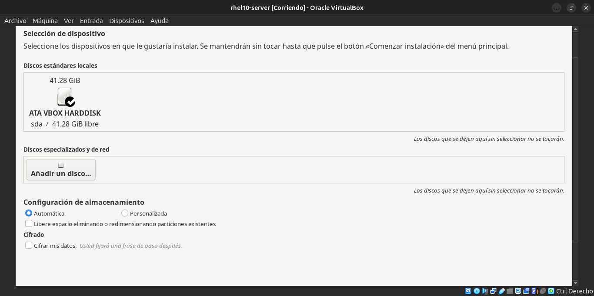

**06 — Creación de usuario**
Usuario administrador `fbeleno` creado con membresía al grupo `wheel` (sudo), contraseña fuerte.
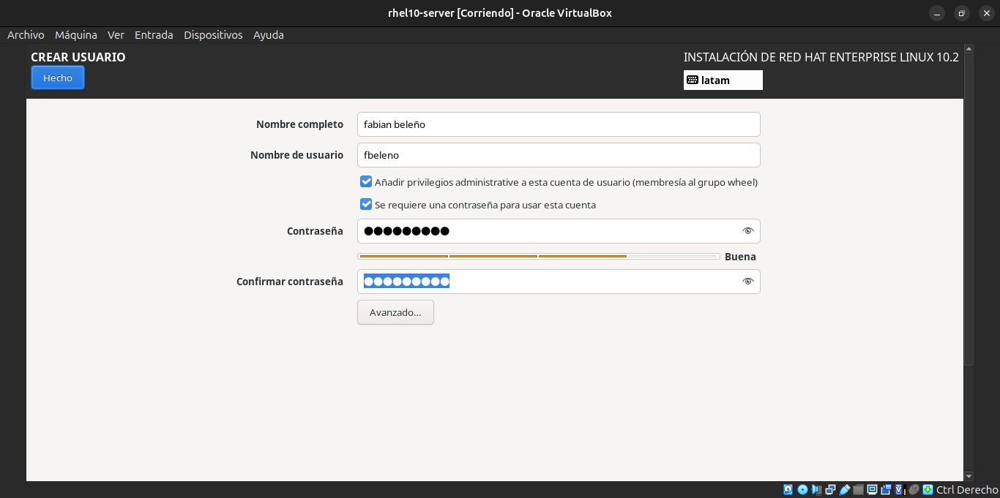

**07 — Hostname**
Nombre de equipo configurado como `rhel10-server.local` desde la pantalla de Red y nombre de equipo.
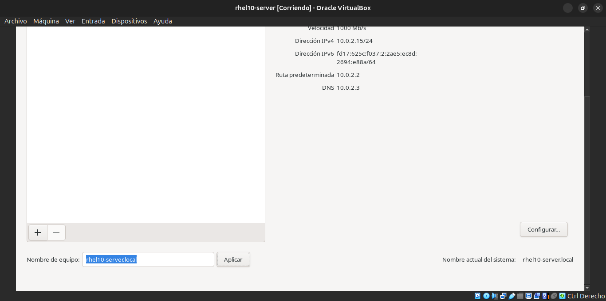

**08 — Instalación completada**
Mensaje "Red Hat Enterprise Linux se ha logrado instalar y está preparado para su uso."
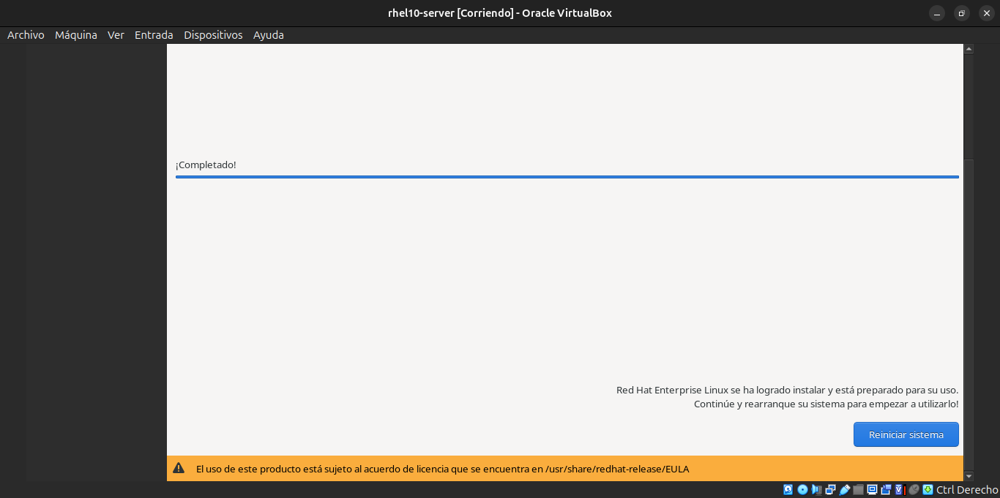

**09 — Error de dnf sin registrar**
`sudo dnf repolist` antes de registrar: "No se pudo leer identidad del consumidor" / "No hay ningún repositorio disponible" — el error intencional central del módulo.
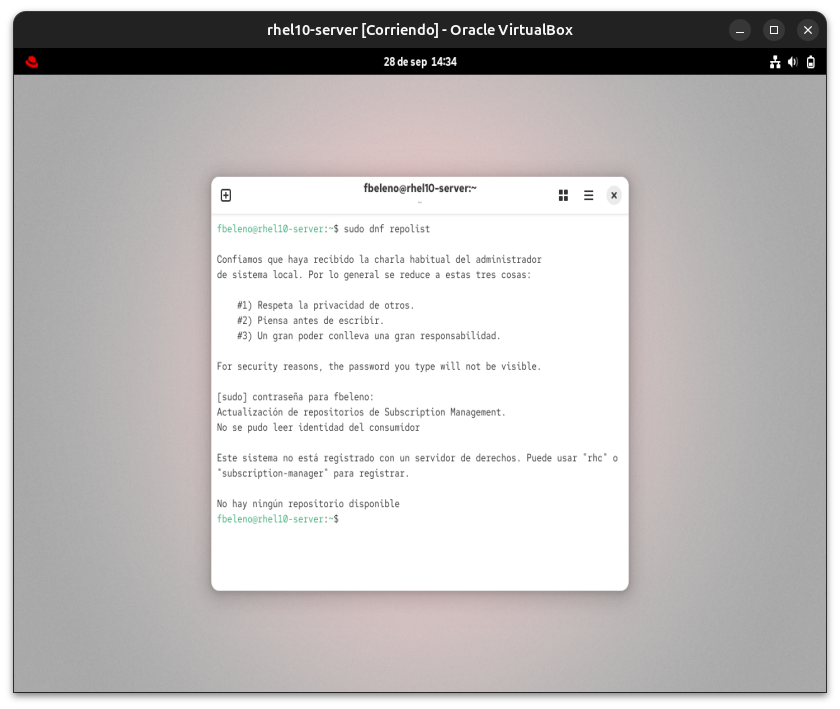

**10 — Registro exitoso**
`subscription-manager register` exitoso, con notificación nativa de GNOME confirmando "Registration Successful".
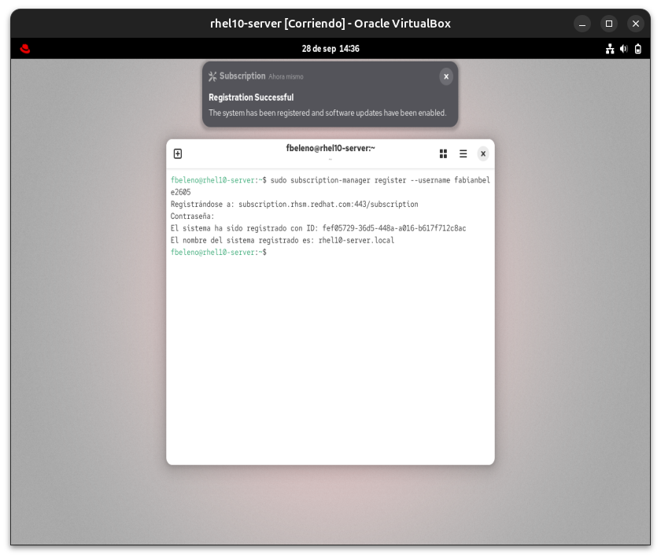

**11 — Status registrado y flags obsoletas**
`subscription-manager status` → "Estatus general: Registrado", y el error real al usar `--available`/`--consumed` (hallazgos #1 y #2).
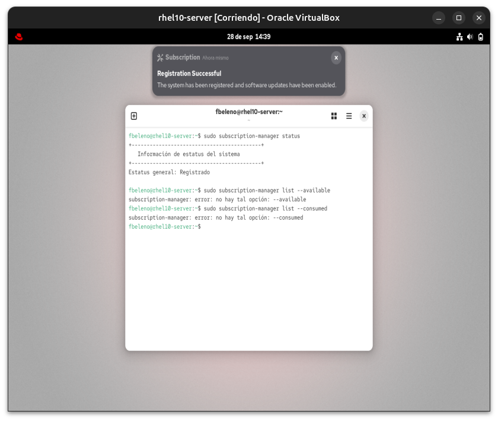

**12 — dnf repolist con BaseOS y AppStream**
Objetivo del módulo cumplido: `subscription-manager list --installed` confirma el producto instalado, y `dnf repolist` muestra BaseOS y AppStream activos.
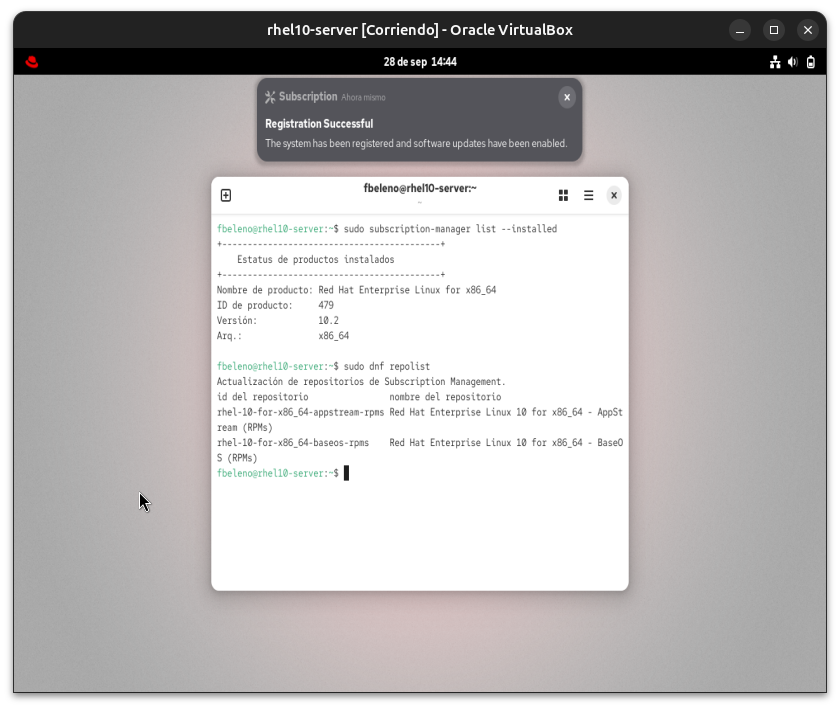

**13 — Hallazgo: kernel headers desfasados**
`uname -r` vs `rpm -q kernel kernel-devel kernel-headers` mostrando el desfase de versión que rompió la primera compilación de Guest Additions (hallazgo #4).
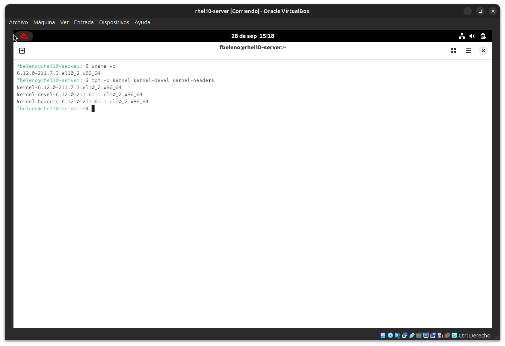

**14 — Guest Additions funcionando**
`lsmod | grep vbox` confirma el módulo `vboxguest` cargado tras actualizar el kernel y reiniciar — resolución ajustada automáticamente.
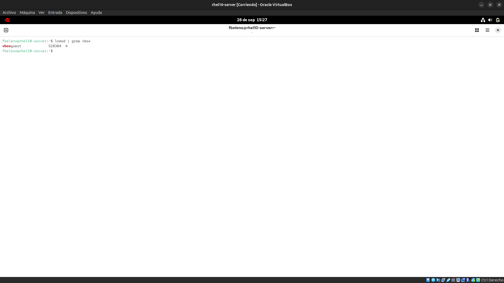

## Pendientes

Ninguno — módulo cerrado.
