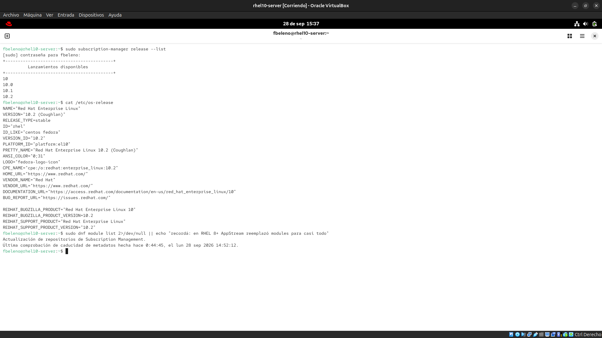

# Módulo 01 — Flujo Fedora → CentOS Stream → RHEL, ciclo de vida de 10 años (EUS/ELS)

- Estado: Completado
- Fecha: 2026-09-28
- Versión: RHEL 10.2 (Coughlan)
- Objetivo diferencial frente a Fedora: Fedora tiene un ciclo de vida corto
  (~13 meses por versión) y es el laboratorio de features nuevas. RHEL
  invierte la lógica: congela una foto estable de CentOS Stream cada minor
  release y la sostiene 10 años, con EUS/ELS como mecanismos de extensión
  que no existen en el mundo Fedora.

## Concepto diferencial

**El flujo real, no lineal**: desde RHEL 8, Fedora prueba features nuevas
sin garantía ni orden fijo. CentOS Stream es una rama de desarrollo
continuo que corre ligeramente adelante de la próxima minor de RHEL — ya
no es "RHEL gratis reconstruido" (el CentOS Linux viejo, descontinuado),
sino donde se desarrolla en público lo que se convertirá en la próxima
RHEL X.Y. RHEL congela esa foto y la convierte en producto estable con
garantías contractuales. Por eso `/etc/os-release` de un RHEL real
declara `ID_LIKE="centos fedora"` — es literal, no marketing.

**Ciclo de vida de 10 años, en fases**: Full Support (~5 años,
actualizaciones normales) → Maintenance Support (~5 años más, solo
parches críticos) → sin soporte salvo ELS.

**EUS vs ELS**:
- **EUS (Extended Update Support)**: clava una **minor version
  específica** (ej. 9.2) recibiendo parches de seguridad más tiempo del
  normal, sin forzar el salto a la siguiente minor. Vive **dentro** del
  ciclo de 10 años. Para producción que no tolera cambios de
  comportamiento por actualizaciones menores (compliance, certificaciones
  de terceros).
- **ELS (Extended Lifecycle Support)**: extiende el soporte **después**
  de terminar el ciclo completo de 10 años de una major, para quien
  todavía no migró.

`subscription-manager release --set=X.Y` es el comando que clava una minor
version y habilita los repos EUS correspondientes (si la suscripción los
incluye).

**El fin (parcial) de AppStream modules**: RHEL 8 introdujo module streams
(`dnf module`, elegir versión de PostgreSQL/Node.js/etc). Desde RHEL 9,
consolidado en RHEL 10, la mayoría se simplificó o eliminó — el paquete
correcto está directo en AppStream sin elegir stream.

## Práctica guiada

```bash
# minor releases disponibles para clavar con EUS
sudo subscription-manager release --list

# linaje real del sistema instalado
cat /etc/os-release

# estado real de AppStream modules en RHEL 10
sudo dnf module list
```

## Hallazgos reales

1. **`/etc/os-release` declara `ID_LIKE="centos fedora"`** — confirmación
   literal, en el sistema instalado, del linaje upstream/downstream de la
   teoría. También aparece `LOGO="fedora-logo-icon"`, remanente curioso de
   theming compartido entre RHEL y Fedora.
2. **`dnf module list` no devolvió ninguna tabla de módulos** en RHEL
   10.2 — solo los mensajes de actualización de metadata, sin error.
   Confirma que el modelo de module streams de RHEL 8 prácticamente
   desapareció: no hace falta memorizar sintaxis de `dnf module` para el
   examen de RHEL 10 de la misma forma que en RHEL 8.
3. **`subscription-manager release --list`** mostró `10, 10.0, 10.1,
   10.2` — se puede clavar tanto la major (`10`, sigue las minors
   automáticamente) como una minor específica (`10.2`, para EUS real).

## Evidencias

**01 — Release list, os-release y dnf module list**
Los tres comandos de la práctica en una sola terminal: `subscription-manager release --list` (10, 10.0, 10.1, 10.2 disponibles), `/etc/os-release` (confirma `ID_LIKE="centos fedora"` y `LOGO="fedora-logo-icon"`), y `dnf module list` retornando vacío tras la actualización de metadata — evidencia de los tres hallazgos del módulo.


## Pendientes

Ninguno — módulo cerrado.
