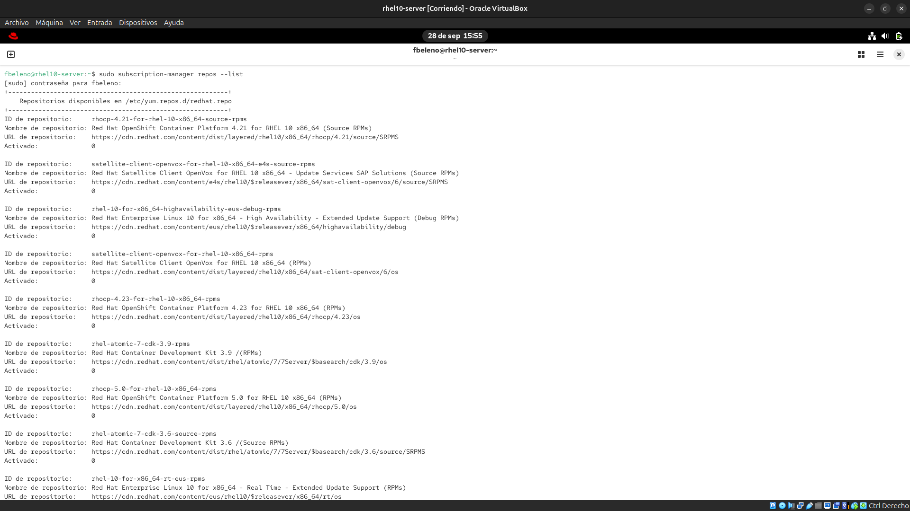
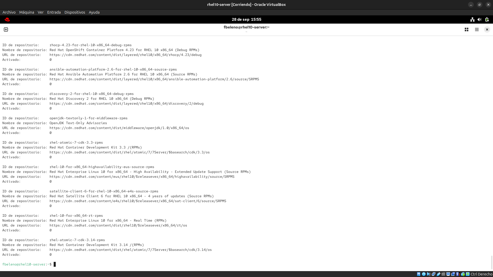
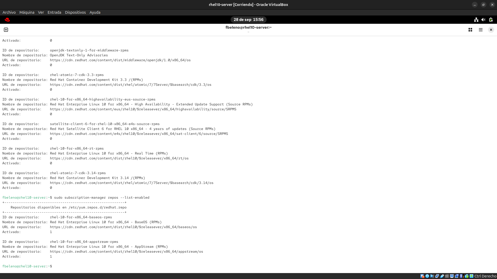
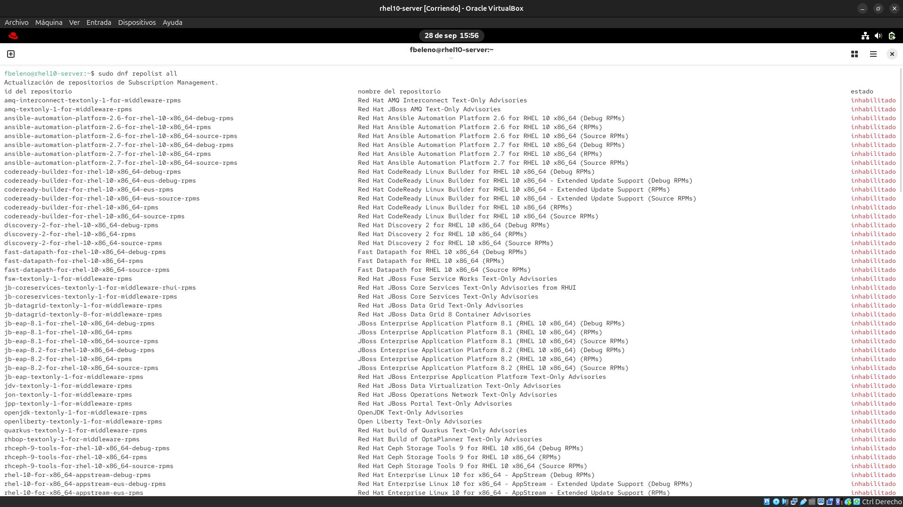
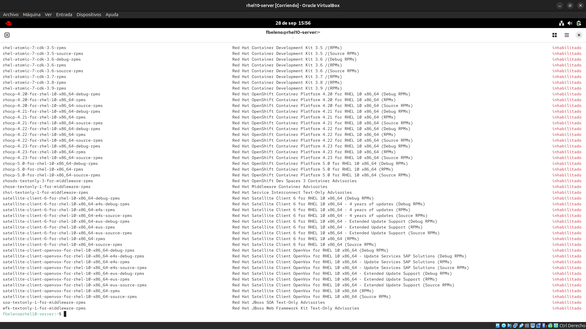
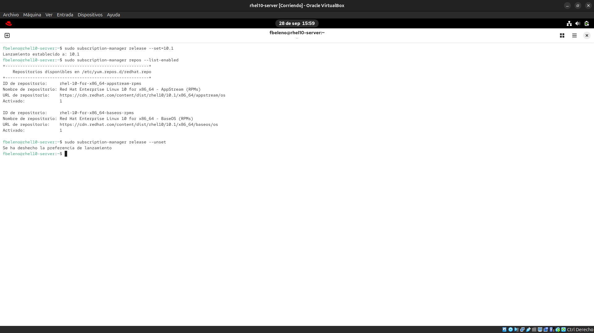

# Módulo 02 — Repos vía `subscription-manager repos`, AppStream/BaseOS

- Estado: Completado
- Fecha: 2026-09-28
- Versión: RHEL 10.2 (Coughlan)
- Objetivo diferencial frente a Fedora: en Fedora todos los repos son
  públicos y no hay concepto de "derecho disponible pero no habilitado".
  En RHEL, `subscription-manager repos --list` expone un catálogo enorme
  al que tu suscripción da *derecho*, independiente de qué esté realmente
  *habilitado* para `dnf` — dos capas que en Fedora no existen.

## Concepto diferencial

`dnf repolist` muestra qué repos están habilitados y activos. `subscription-manager
repos --list` muestra **todos** los repos a los que la suscripción da
derecho, estén habilitados o no — la vista completa del "derecho de
acceso" antes del filtro de `dnf`. Habilitar/deshabilitar repos con
derecho pero no activos se hace con `subscription-manager repos
--enable=<repo-id>` / `--disable=<repo-id>`.

**CodeReady Builder (CRB)**: repo con paquetes `-devel`, herramientas de
compilación y dependencias que EPEL necesita como base — se habilita para
el módulo de Rust (fase IX).

**`dnf config-manager` como alternativa**: en RHEL 10 con `dnf5`, `dnf
config-manager --set-enabled <repo>` hace lo mismo que `subscription-manager
repos --enable` para repos ya conocidos por el sistema.

## Práctica guiada

```bash
# catálogo completo al que la suscripción da derecho
sudo subscription-manager repos --list

# solo lo que realmente está habilitado
sudo subscription-manager repos --list-enabled

# la misma vista desde el lado de dnf
sudo dnf repolist all

# efecto de clavar una minor version (EUS) en los repos habilitados
sudo subscription-manager release --set=10.1
sudo subscription-manager repos --list-enabled
sudo subscription-manager release --unset
```

## Hallazgos reales

1. **La Developer Subscription for Individuals da derecho a mucho más que
   BaseOS/AppStream**: `subscription-manager repos --list` mostró
   cientos de repos con `Activado: 0` — OpenShift Container Platform
   (`rhocp-*`), Red Hat Satellite Client, Ansible Automation Platform,
   JBoss EAP/Fuse/Data Grid, OpenJDK, Ceph Storage Tools, e incluso el
   viejo `rhel-atomic-7-cdk` (container tooling pre-Podman). La teoría
   del módulo 00 solo mencionaba BaseOS/AppStream — la realidad es un
   catálogo de middleware enterprise completo, todo accesible con la
   cuenta gratuita, simplemente no habilitado por defecto.
2. **`subscription-manager repos --list-enabled` y `dnf repolist all`
   confirman lo mismo desde ambos lados**: solo BaseOS y AppStream están
   realmente activos, el resto es derecho sin habilitar.
3. **`release --set=10.1` no activa repos `-eus-` dedicados** — en su
   lugar, reescribe la URL de los mismos repos de siempre
   (`rhel-10-for-x86_64-baseos-rpms`) de `$releasever` (variable) a
   `10.1` (ruta literal fija). Los repos EUS reales (listados por
   separado como `-eus-rpms`) requieren un entitlement EUS específico que
   la Developer Subscription no incluye. Distinción real entre "clavar la
   versión en la URL" y "tener derecho a los repos EUS verdaderos".
4. **`release --unset` deshace el pin limpio**, confirmado con "Se ha
   deshecho la preferencia de lanzamiento" — el sistema vuelve a seguir
   `$releasever` dinámico.

## Evidencias

**01 — Catálogo completo de repos disponibles**
`subscription-manager repos --list`: catálogo extenso (OpenShift, Satellite, Ansible Automation Platform, JBoss, etc.), todos `Activado: 0` salvo BaseOS/AppStream más abajo en el listado.



**02 — Repos realmente habilitados**
`subscription-manager repos --list-enabled`: solo BaseOS y AppStream con `Activado: 1`.


**03 — Vista completa desde dnf**
`dnf repolist all`: mismo catálogo gigante visto desde `dnf`, la inmensa mayoría `inhabilitado`.



**04 — Efecto de release --set y --unset**
`release --set=10.1` reescribe la URL de baseos/appstream a la ruta literal `10.1` (no activa repos `-eus-`), y `release --unset` deshace el pin.


## Pendientes

Ninguno — módulo cerrado.
