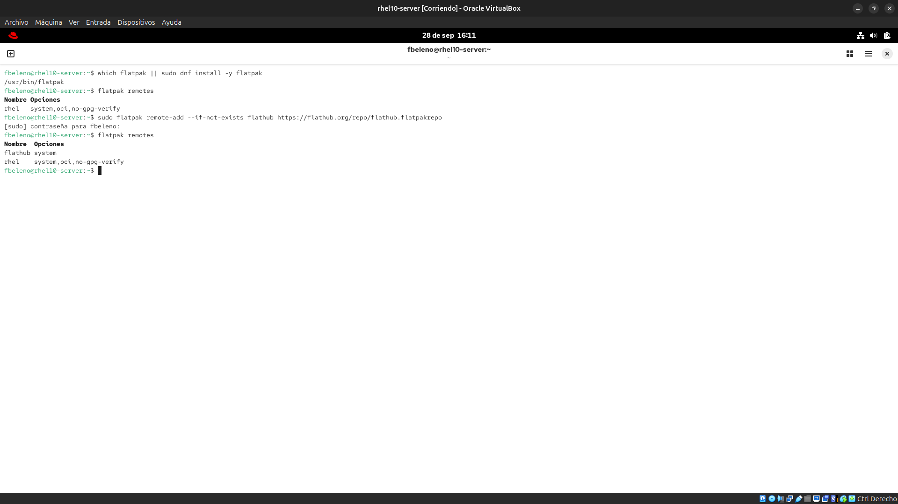
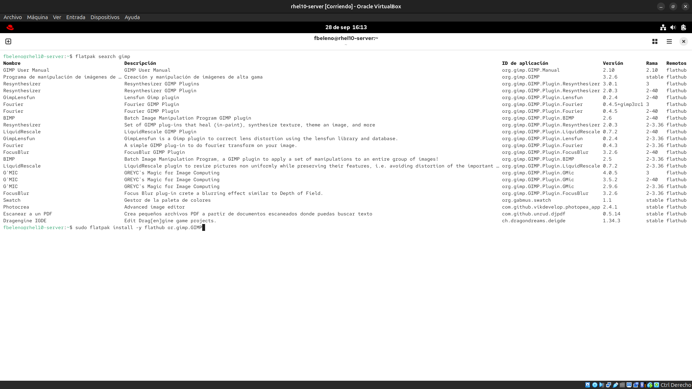
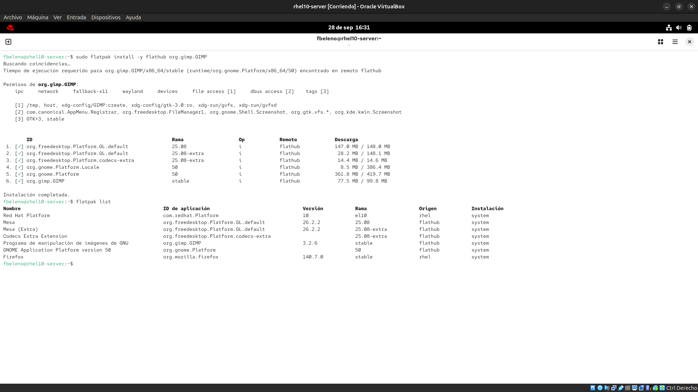

# Módulo 03 — Flatpak: remoto, búsqueda, instalación, listado

- Estado: Completado
- Fecha: 2026-09-28
- Versión: RHEL 10.2 (Coughlan)
- Objetivo diferencial frente a Fedora: en Fedora Workstation/Silverblue
  el remoto Flathub viene preconfigurado de fábrica, y en Silverblue
  Flatpak es central a todo el sistema vía rpm-ostree. En RHEL 10 no hay
  ningún remoto por defecto, ni el paquete `flatpak` garantizado en toda
  instalación — se agrega todo a mano.

## Concepto diferencial

Flatpak es nuevo en los objetivos oficiales del EX200 sobre RHEL 10 —
forma de distribuir apps de escritorio/GUI sandboxeadas, independiente del
ciclo de vida de AppStream. Para el examen se espera manejo de: agregar un
remoto, buscar e instalar una app puntual, y listar lo instalado.

**Comando central**: `flatpak remote-add --if-not-exists flathub
https://flathub.org/repo/flathub.flatpakrepo` — el `--if-not-exists` es
clave para idempotencia (relevante para Ansible en la fase VIII).

**Búsqueda e instalación**: `flatpak search <término>` contra los remotos
configurados, `flatpak install <remoto> <app-id>`, `flatpak list` (con
`--app` o `--runtime` para filtrar) para ver qué quedó instalado.

## Práctica guiada

```bash
# confirmar si flatpak está instalado
which flatpak || sudo dnf install -y flatpak

# remotos configurados (esperado: ninguno por defecto en RHEL)
flatpak remotes

# agregar Flathub
sudo flatpak remote-add --if-not-exists flathub https://flathub.org/repo/flathub.flatpakrepo

# confirmar el remoto agregado
flatpak remotes

# buscar, instalar y listar una app concreta
flatpak search gimp
sudo flatpak install -y flathub org.gimp.GIMP
flatpak list
```

## Hallazgos reales

1. **`flatpak` ya venía instalado** (`/usr/bin/flatpak`) — parte del grupo
   de paquetes "Server with GUI" elegido en Anaconda, no hubo que
   instalarlo aparte.
2. **RHEL 10 sí trae un remoto por defecto**, contrario a lo que
   anticipaba la teoría: `flatpak remotes` (antes de agregar Flathub) ya
   mostraba un remoto llamado `rhel` con opciones `system,oci,no-gpg-verify`
   — un remoto basado en **OCI** (imágenes de contenedor, no el protocolo
   clásico de Flatpak), para las apps que el propio Red Hat distribuye
   vía su registry de contenedores.
3. **Ese remoto `rhel` no estaba vacío**: `flatpak list` reveló que
   **Firefox ya estaba instalado como Flatpak** (`org.mozilla.firefox`,
   origen `rhel`) desde el momento de la instalación del sistema. RHEL 10
   con "Server with GUI" distribuye Firefox como Flatpak vía su propio
   registry OCI, no como RPM tradicional — un cambio real de packaging
   frente a versiones anteriores de RHEL/Fedora clásico.
4. **La instalación de GIMP desde Flathub trajo runtimes pesados**
   (Mesa/GL, GNOME Platform 50, codecs extra) — confirma que Flatpak
   resuelve dependencias de runtime completas, independientes de
   AppStream/BaseOS, tal como plantea la teoría de sandboxing.

## Evidencias

**01 — Flatpak preinstalado y remoto `rhel` por defecto**
`which flatpak` confirma que ya estaba instalado; `flatpak remotes` antes de agregar Flathub ya mostraba el remoto OCI `rhel`; después de `remote-add`, aparecen ambos remotos.


**02 — Resultados de búsqueda**
`flatpak search gimp` contra Flathub: GIMP y todo su ecosistema de plugins/runtimes disponibles.


**03 — Instalación de GIMP y listado con Firefox preinstalado**
Instalación completa con permisos y runtimes descargados, y `flatpak list` final mostrando GIMP recién instalado junto a Firefox (ya presente desde el remoto `rhel`).


## Pendientes

Ninguno — módulo cerrado.
