# Módulo 04 — Simulacro cronometrado de gestión de software (cierre Fase I)

- Estado: Completado
- Fecha: 2026-09-28
- Versión: RHEL 10.2 (Coughlan)
- Objetivo diferencial frente a Fedora: en Fedora se practicó `dnf`/`rpm`
  sin presión de tiempo, enfocado en entender qué hace cada comando. Acá
  el objetivo es velocidad y precisión bajo reloj — la habilidad que
  realmente evalúa el RHCSA no es "saber el comando" sino "ejecutarlo
  rápido sin errores", en un bloque que mezcla herramientas sin avisar
  cuál toca en cada tarea.

## Concepto diferencial

Este módulo no introduce teoría nueva: integra todo lo de la Fase I
(dnf/rpm ya conocido de Fedora, `subscription-manager repos` y Flatpak de
los módulos 02-03) bajo presión de tiempo, imitando el formato de un
bloque de examen real dentro de las 3 horas del RHCSA.

**Meta**: 15 minutos para las 8 tareas de abajo. Regla del simulacro: las
tareas se dan de una sola vez (como el enunciado real), se corre el reloj
sin pausas, y la revisión de qué salió bien/mal se hace al final, no en
el medio — salvo que el problema sea de infraestructura (VM/red), no de
conocimiento.

## Práctica guiada — enunciado del simulacro

Arrancá el reloj y resolvé, en orden o no (como en el examen real):

1. Instalar el paquete `tree` con `dnf`.
2. Averiguar con `rpm` qué paquete provee el archivo `/usr/bin/tree`, y
   ver su información completa (resumen, versión, licencia).
3. Listar todos los archivos que instaló el paquete `tree`.
4. Verificar la integridad del paquete `tree` instalado (no debería
   reportar ningún cambio).
5. Remover `tree` con `dnf`, y luego **deshacer esa transacción**
   específica con `dnf history` para que vuelva a quedar instalado (sin
   reinstalarlo a mano).
6. Instalar el grupo de paquetes **"Development Tools"** con `dnf`.
7. Instalar la app Flatpak **VLC** (`org.videolan.VLC`) desde Flathub.
8. Remover la app VLC y limpiar los runtimes que hayan quedado sin uso.

```bash
# antes de arrancar el reloj, estado limpio conocido
rpm -q tree || echo "tree no instalado (esperado)"
sudo dnf history list | head -5
date
```

## Hallazgos reales

1. **`tree` ya venía instalado** desde Anaconda (repositorio `@anaconda`
   en `rpm -qi`, `Install Date` coincidente con el primer boot) — nunca
   asumas el estado "limpio" de un paquete sin verificarlo antes de
   arrancar una tarea, ni siquiera en un simulacro armado a propósito.
2. **`dnf history undo` reinstala desde el repo real** (`rhel-10-for-x86_64-baseos-rpms`,
   59k de descarga) cuando el paquete ya no está en caché local, aunque
   la instalación original haya sido "gratis" desde el medio de
   instalación — el undo no es un simple "deshacer", ejecuta una
   instalación real.
3. **`dnf group list` no muestra "Development Tools" en inglés** — aparece
   traducido como "Herramientas de desarrollo", distinto de "Herramientas
   de Desarrollo RPM" (grupo separado, para tooling de construcción de
   paquetes). A pesar de la traducción, `dnf group install -y "Development
   Tools"` funcionó — `dnf` matchea por el ID/nombre canónico interno,
   no por el nombre traducido visible en pantalla. Clave para no
   bloquearse en el examen si el nombre no aparece literal en el listado.
4. **Los runtimes de Flatpak dependen del toolkit gráfico de la app, no
   solo de la app en sí**: GIMP (GTK/GNOME) trajo `org.gnome.Platform`;
   VLC (Qt/KDE) trajo `org.kde.Platform`, con una descarga mucho más
   pesada (367 MB) y mucho más lenta (~13 minutos) que la de GIMP. Esto
   es un costo real a tener en cuenta antes de instalar apps Flatpak en
   producción con ancho de banda limitado.
5. **`flatpak uninstall --unused` limpia exactamente lo que corresponde**:
   tras remover VLC, el comando eliminó los 4 componentes KDE que ya no
   tenían ninguna app dependiente, dejando el sistema en el mismo estado
   que antes de instalar VLC (`flatpak list` final: Red Hat Platform,
   Mesa, GIMP, GNOME Platform, Firefox).

## Evidencias

**01 — Estado inicial y arranque del reloj**
Confirmación de que `gimp` no está como RPM, historial de `dnf` previo, y hora de arranque del simulacro.
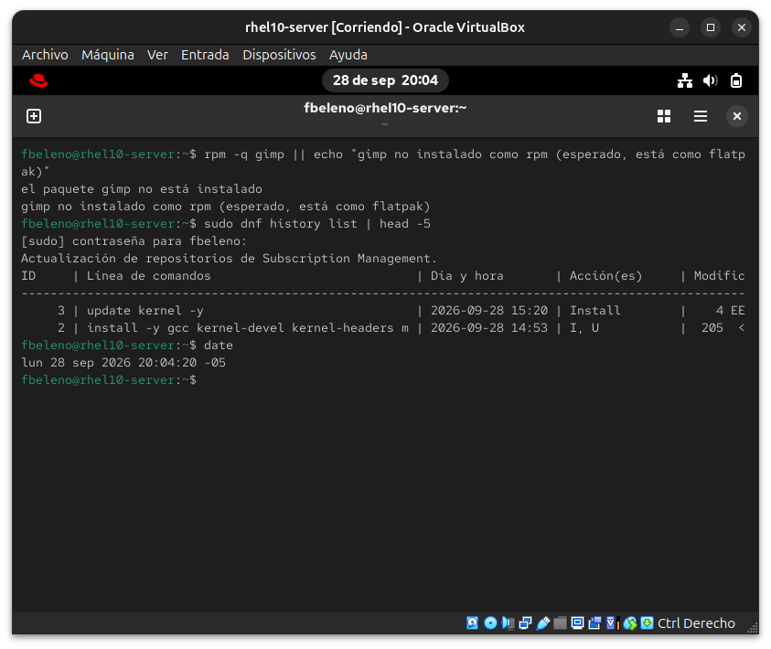

**02 — Tarea 1: instalar tree**
`dnf install tree` reporta "ya está instalado" — hallazgo #1, tree vino con Anaconda.
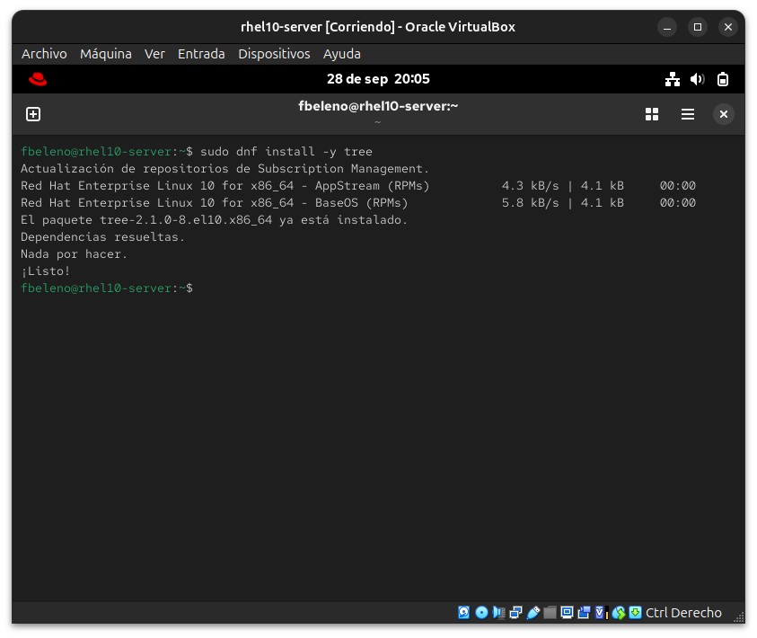

**03 — Tarea 2: rpm -qf y rpm -qi**
Identificación del paquete dueño de `/usr/bin/tree` e información completa, incluyendo `Install Date` coincidente con el primer boot.
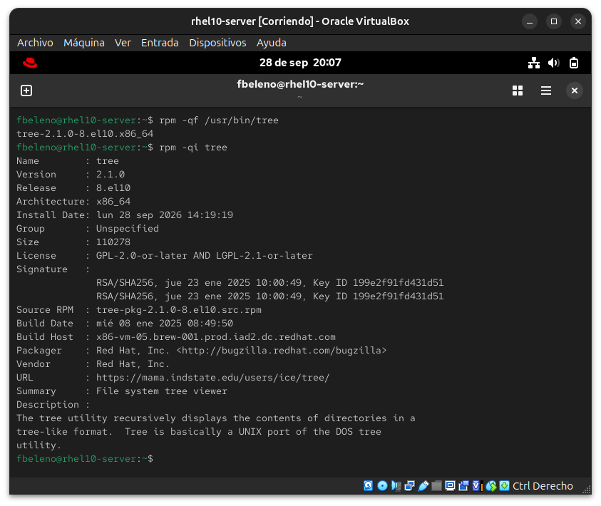

**04 — Tarea 3: rpm -ql**
Listado completo de archivos instalados por el paquete `tree`.
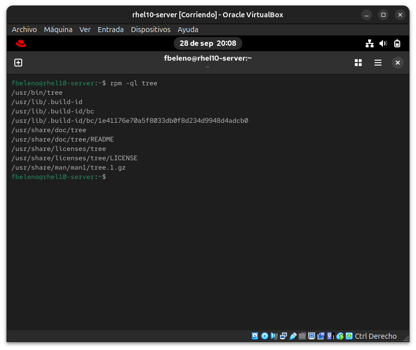

**05 — Tarea 4: rpm -V**
Verificación de integridad sin salida — ningún archivo modificado.
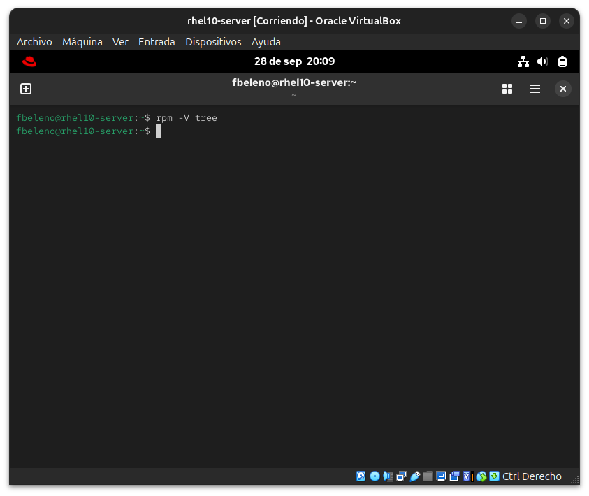

**06 — Tarea 5, parte 1: remover tree**
`dnf remove tree`, confirmando el repositorio original `@anaconda`.
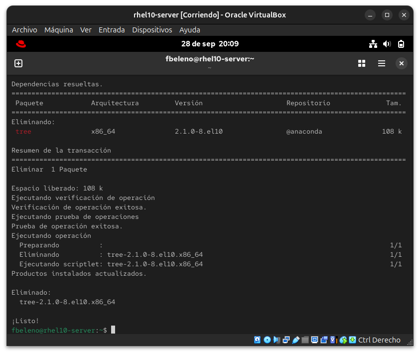

**07 — Tarea 5, parte 2: historial y undo**
`dnf history list` muestra la transacción de remoción como ID 4; `dnf history undo 4` la reinstala desde el repo BaseOS real (hallazgo #2).
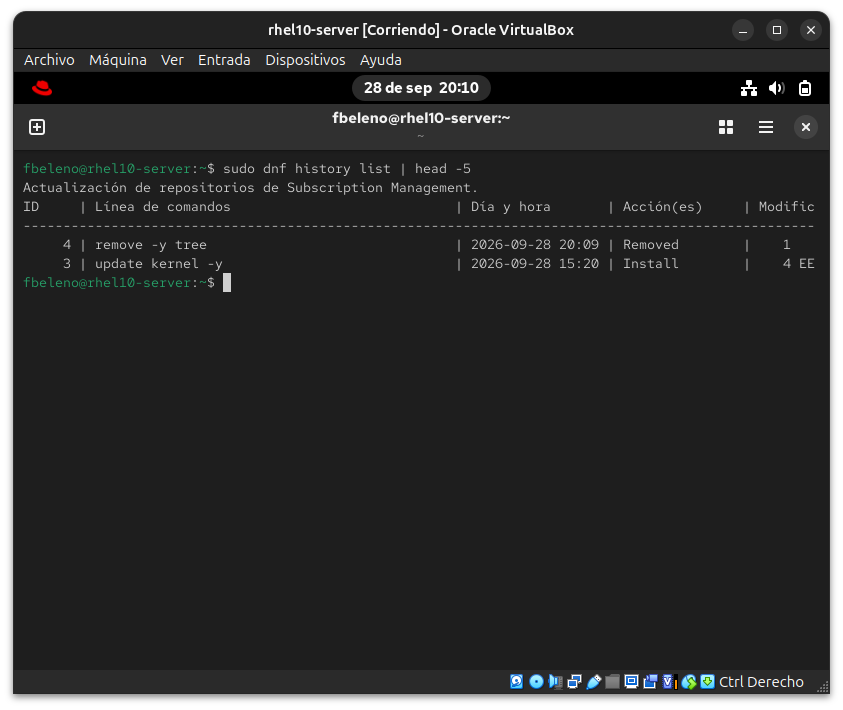
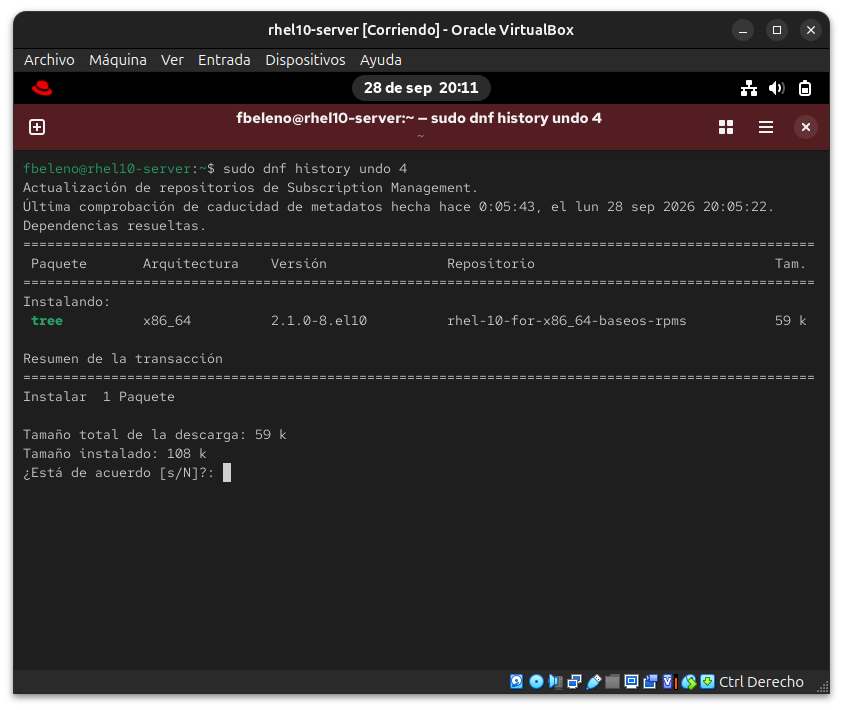
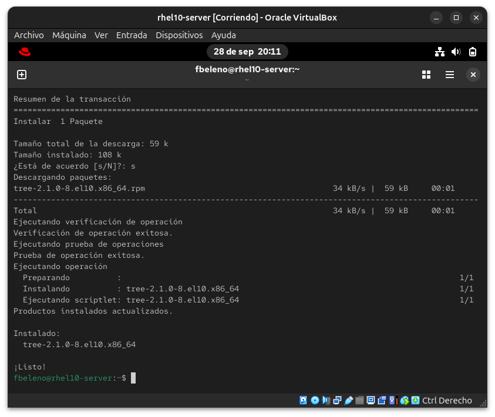

**08 — Tarea 6: grupo Development Tools**
`dnf group list` con los nombres traducidos (hallazgo #3), y `dnf group install -y "Development Tools"` instalando el toolchain completo (autoconf, automake, gdb, git, valgrind, rpm-build, etc.).
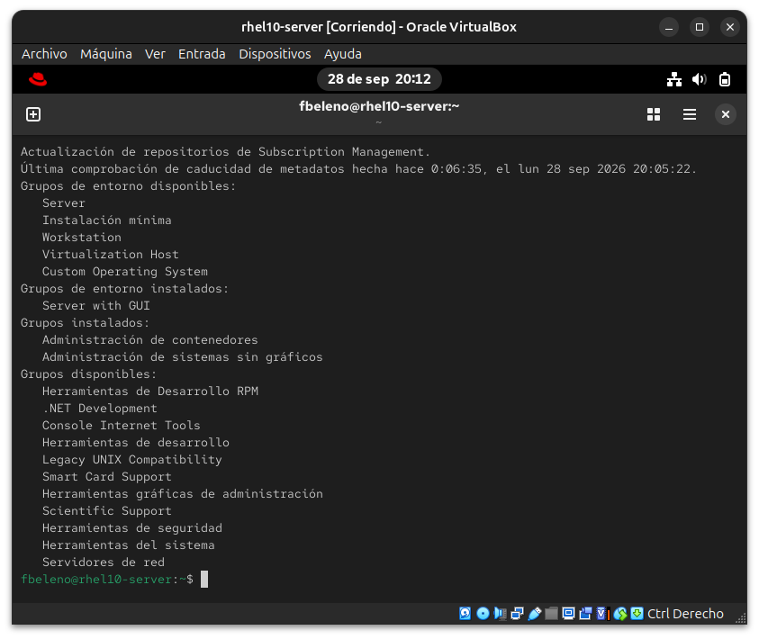
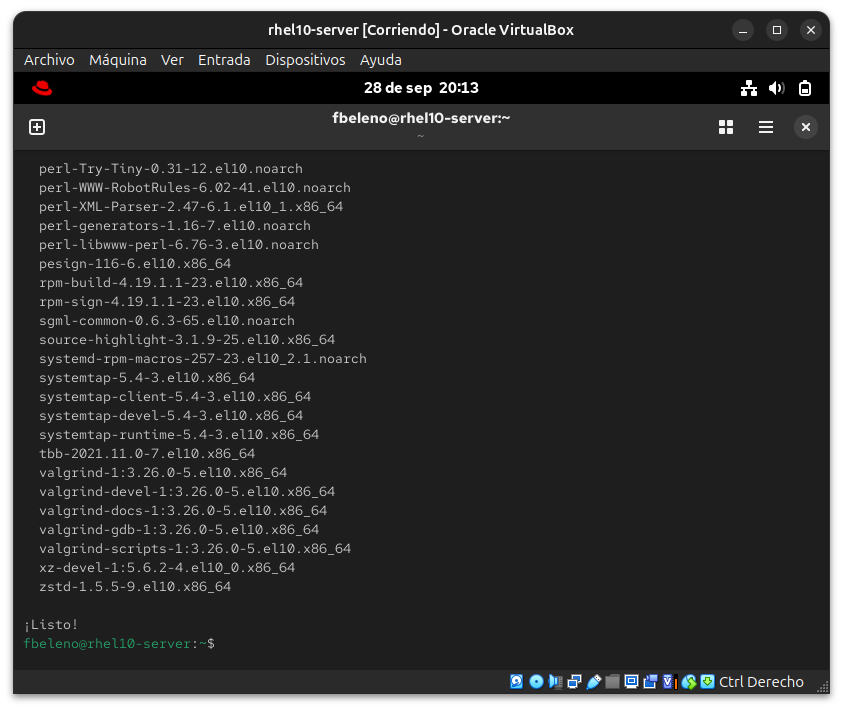
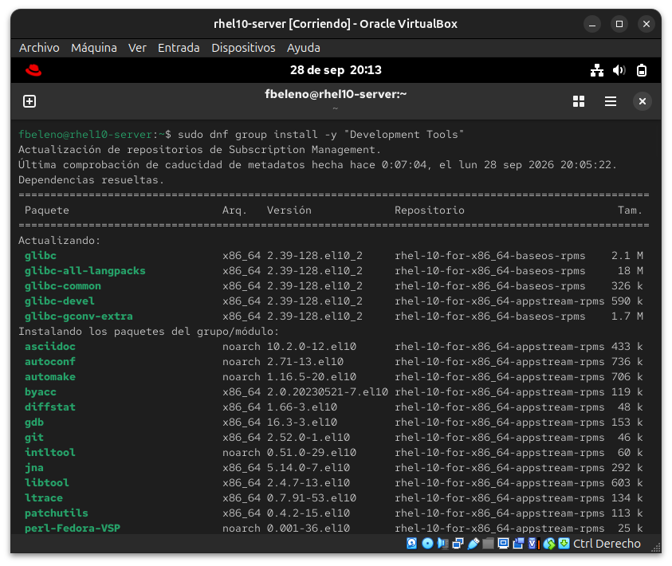

**09 — Tarea 7: Flatpak VLC**
Instalación de VLC desde Flathub, mostrando el runtime pesado de KDE Platform (hallazgo #4) al inicio y al completarse (367 MB, ~13 minutos).
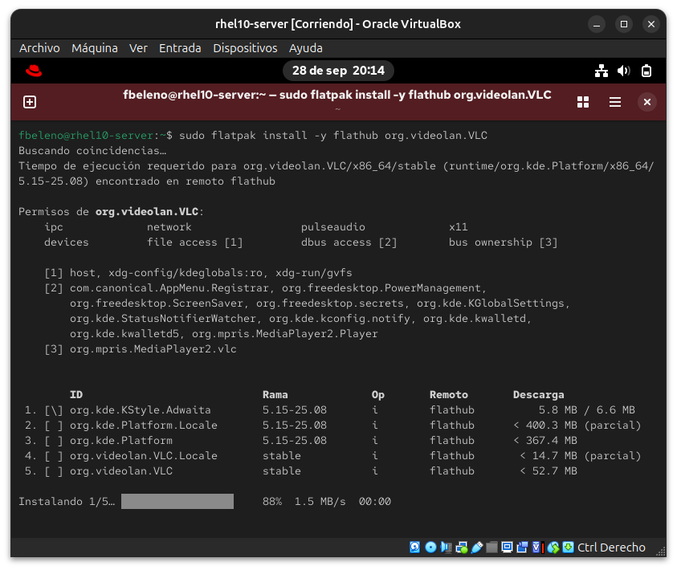
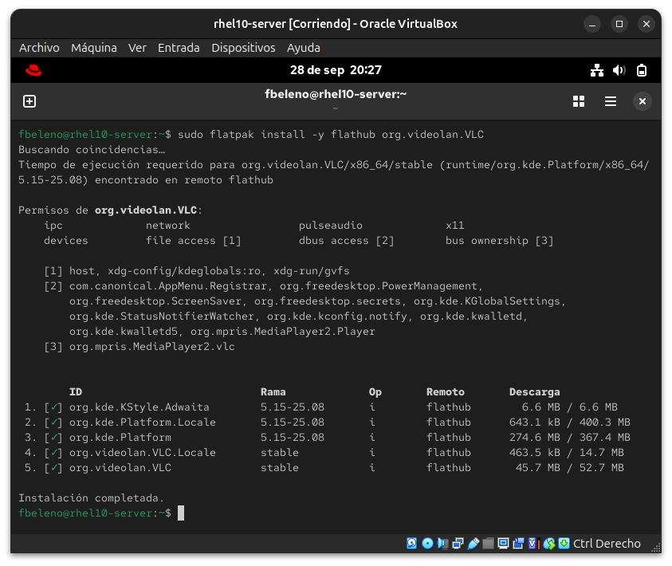

**10 — Tarea 8: remoción y limpieza**
`flatpak uninstall` de VLC, `--unused` limpiando los 4 componentes KDE huérfanos (hallazgo #5), y `flatpak list` final confirmando el estado limpio.
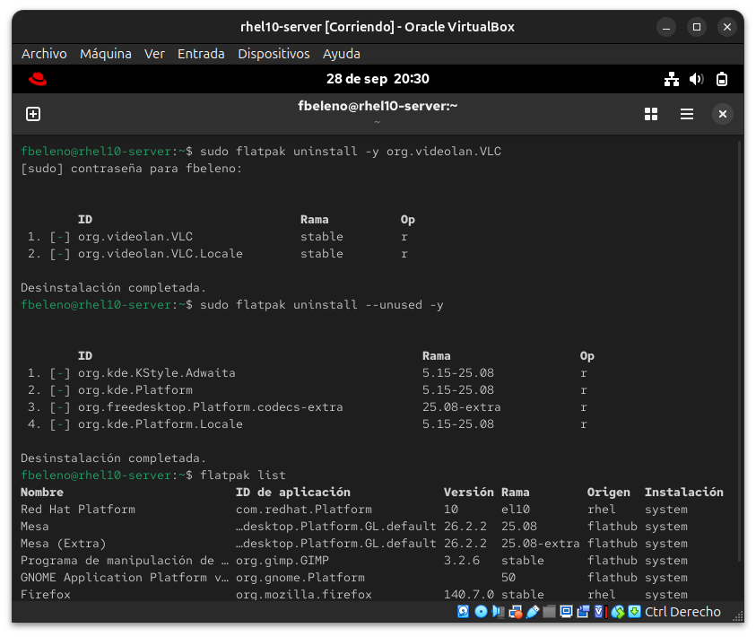

## Pendientes

Ninguno — módulo cerrado. Tiempo real: ~26 minutos contra la meta de 15
(esperable en la primera pasada explicada paso a paso; repetir sin
explicaciones para medir tiempo real de examen queda como ejercicio
opcional futuro).
