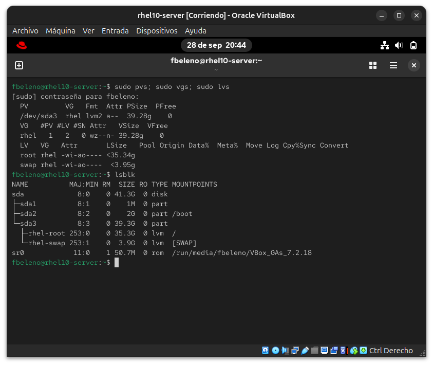
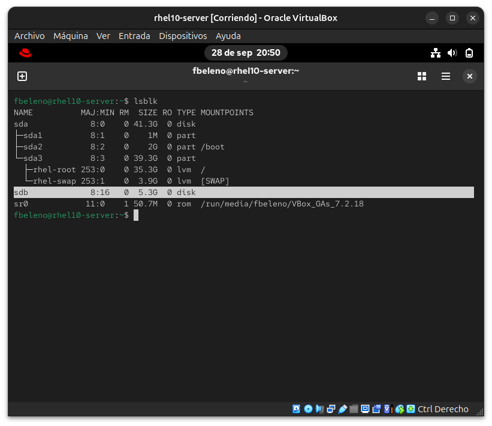
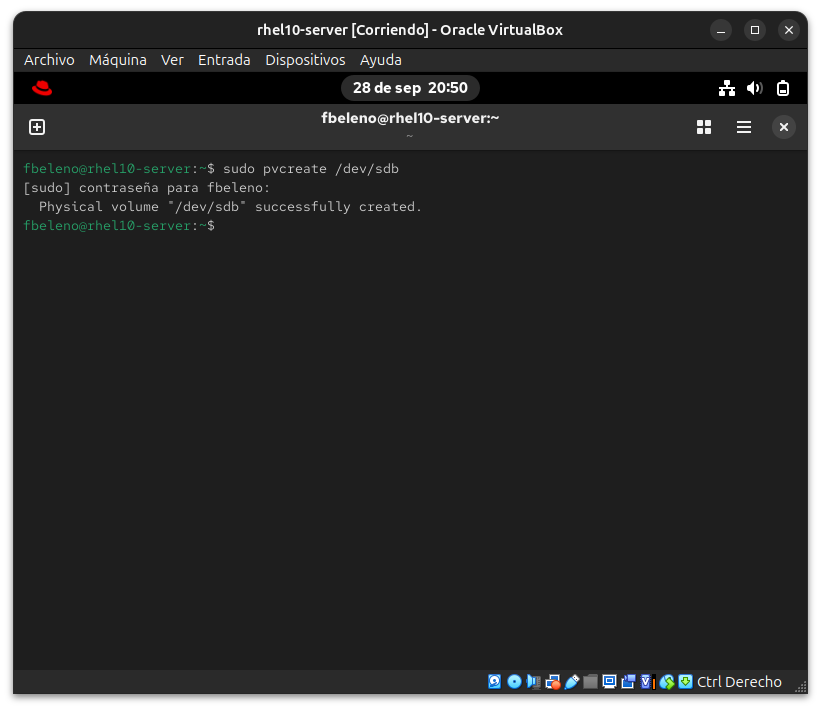
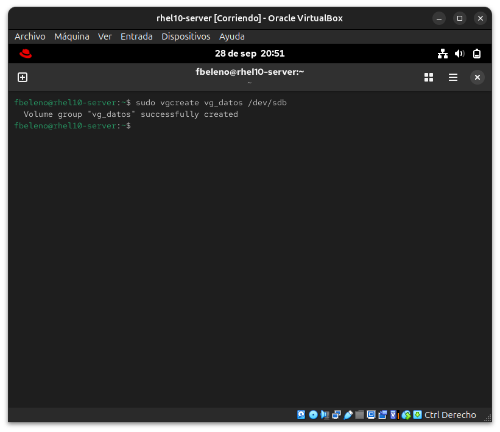
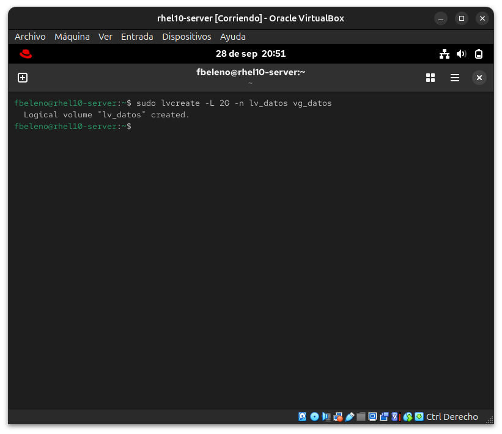
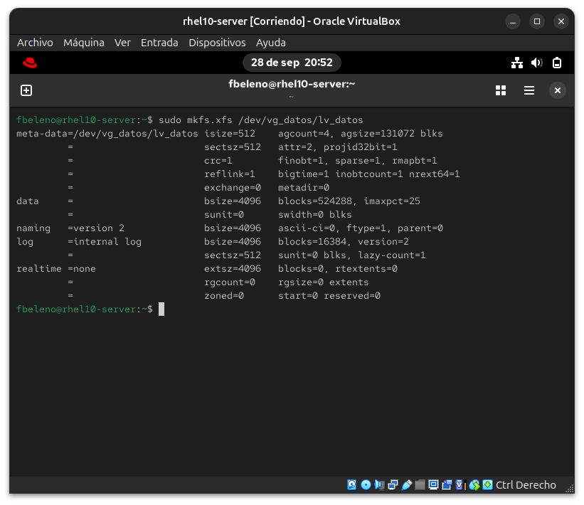
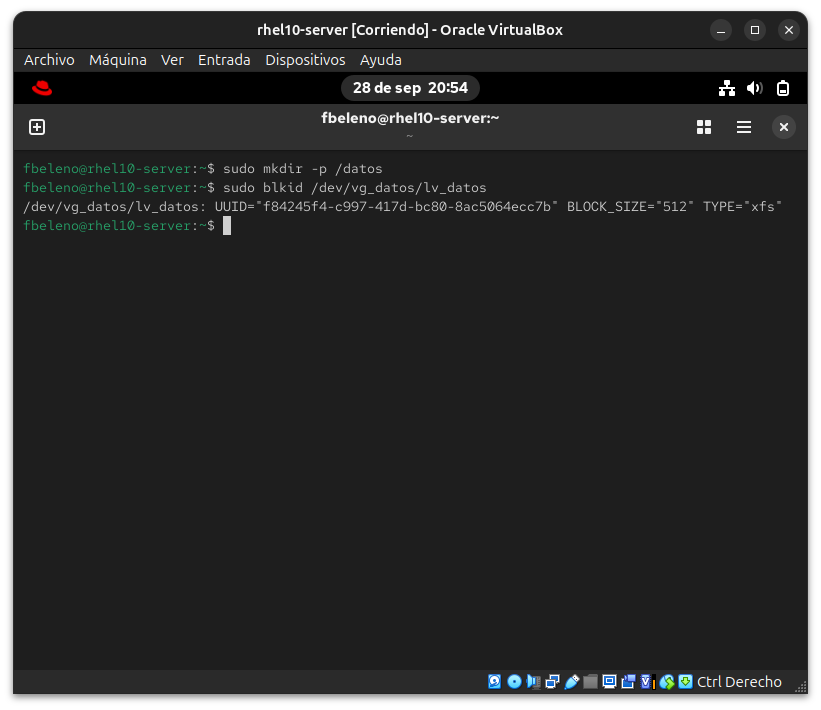
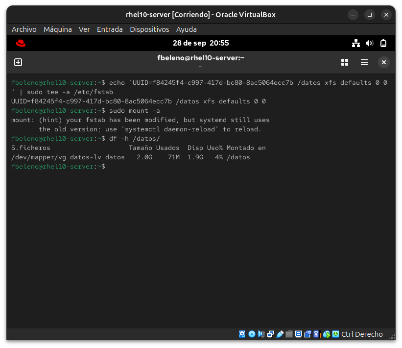
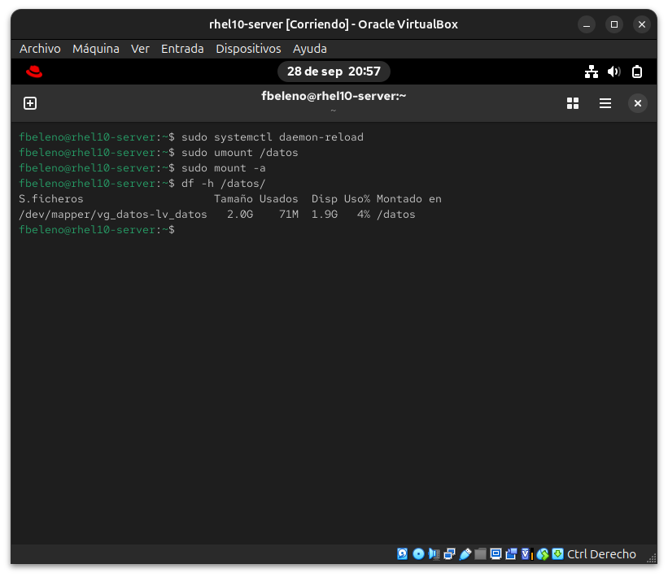
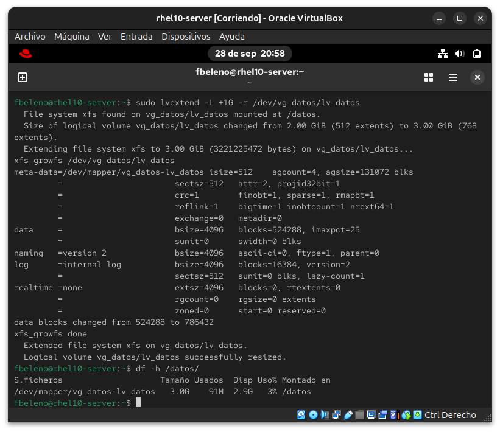

# Módulo 05 — LVM completo cronometrado (meta: bajar de 6 minutos)

- Estado: Completado
- Fecha: 2026-09-28
- Versión: RHEL 10.2 (Coughlan)
- Objetivo diferencial frente a Fedora: Fedora Server también usa
  LVM+XFS por defecto en Anaconda — no hay diferencia conceptual ahí, y
  PV/VG/LV ya se cubrieron a fondo en Arch. La diferencia real de este
  módulo es la **velocidad bajo presión de examen** y un detalle técnico
  concreto: XFS (default en RHEL desde la 7) **solo crece, nunca se
  achica** — no hay `resize2fs` ni `lvreduce` seguro como con ext4.

## Concepto diferencial

Armar el stack completo de LVM (disco → PV → VG → LV → filesystem →
mount persistente) es una de las tareas más comunes y "baratas en puntos"
del RHCSA si está automatizada de memoria. El objetivo no es entender qué
es un PV o un VG — eso ya se vio en Arch — sino ejecutarlo sin dudar bajo
reloj.

**Cadena de comandos**: `pvcreate` → `vgcreate` → `lvcreate` → `mkfs.xfs`
→ `mount` + entrada persistente en `/etc/fstab` (con UUID, nunca con
`/dev/sdX` a mano — los nombres de dispositivo pueden cambiar entre
reboots).

**Extender en caliente**: `lvextend -r` hace resize del filesystem en el
mismo comando que extiende el LV, ahorrando un paso separado de
`xfs_growfs`.

**La trampa de XFS**: a diferencia de ext4, **XFS no se puede achicar**.
Si en el examen te piden reducir un LV con XFS, la única forma real es
recrear el filesystem desde cero con el tamaño correcto (backup → borrar
→ recrear más chico → restaurar). Confundir esto en el momento cuesta
carísimo en tiempo.

## Práctica guiada — enunciado del simulacro

**Antes de arrancar el reloj**: agregar un disco virtual nuevo de 5 GB a
`rhel10-server` desde VirtualBox (Configuración → Almacenamiento → Añadir
disco duro, con la VM apagada), para no tocar el disco del sistema.

Arrancá el reloj y resolvé:

1. Confirmar que el disco nuevo aparece en el sistema (`lsblk`) sin LVM
   previo.
2. Crear un Physical Volume sobre el disco completo.
3. Crear un Volume Group llamado `vg_datos` sobre ese PV.
4. Crear un Logical Volume de 2 GB llamado `lv_datos` dentro de `vg_datos`.
5. Formatear `lv_datos` con XFS.
6. Montarlo en `/datos`, y dejar el montaje persistente en `/etc/fstab`
   usando el UUID del filesystem (no la ruta del dispositivo).
7. Verificar que sobrevive: `umount` + `mount -a` sin errores.
8. Extender `lv_datos` en 1 GB más (a 3 GB total) y hacer crecer el
   filesystem en el mismo paso con `lvextend -r`.

```bash
# antes de arrancar el reloj, estado limpio conocido
sudo pvs; sudo vgs; sudo lvs
lsblk
```

## Hallazgos reales

1. **El disco del sistema (`sda3`) ya es un PV** dentro del VG `rhel`,
   con LVs `root` (35.34g) y `swap` (3.95g) — confirmado con
   `pvs`/`vgs`/`lvs` antes de agregar el disco nuevo. El particionado
   automático de Anaconda (módulo 00) usa LVM de fábrica, no es un
   esquema opcional que haya que elegir a mano.
2. **`mount -a` avisa sobre `systemd daemon-reload` tras editar `/etc/fstab`
   a mano**: `mount: (hint) your fstab has been modified, but systemd
   still uses the old version; use 'systemctl daemon-reload' to reload.`
   `mount -a` funciona igual porque lee `/etc/fstab` directo sin pasar
   por systemd, pero las unidades `.mount` autogeneradas por systemd
   quedan con la versión vieja hasta el reload — relevante si algo más
   depende de esa unidad (`systemctl start datos.mount`, dependencias
   de servicio). Buena práctica real: `systemctl daemon-reload` después
   de cualquier edición manual de `fstab`.
3. **`lvextend -r` resuelve extender LV + filesystem en un solo comando**,
   confirmado end-to-end: el LV pasó de 2.00 GiB a 3.00 GiB y
   `xfs_growfs` corrió automáticamente adentro del mismo comando (data
   blocks 524288 → 786432) — sin pasos separados, tal como plantea la
   teoría para ahorrar tiempo en el examen.

## Evidencias

**01 — Estado inicial: LVM ya presente en el disco del sistema**
`pvs`/`vgs`/`lvs`/`lsblk` en el sistema corriendo, revelando que `sda3` ya es PV de un VG `rhel` con LVs root/swap (hallazgo #1).


**02 — Disco nuevo confirmado**
`lsblk` tras agregar el disco de 5.3 GB en VirtualBox: `sdb` aparece limpio, sin particiones.


**03 — Tarea 2: pvcreate**
`pvcreate /dev/sdb` exitoso.


**04 — Tarea 3: vgcreate**
`vgcreate vg_datos /dev/sdb` exitoso.


**05 — Tarea 4: lvcreate**
`lvcreate -L 2G -n lv_datos vg_datos` exitoso.


**06 — Tarea 5: mkfs.xfs**
Formateo XFS del LV, 524288 bloques (2 GB) confirmados.


**07 — Tarea 6, parte 1: UUID del filesystem**
`blkid` obteniendo el UUID real para usar en `/etc/fstab`.


**08 — Tarea 6, parte 2: fstab, mount -a y el aviso de systemd**
Entrada agregada a `/etc/fstab` con el UUID, `mount -a` con el hallazgo #2 (aviso de daemon-reload), y `df -h` confirmando el montaje en `/datos`.


**09 — Tarea 7: persistencia verificada**
`daemon-reload`, `umount` y `mount -a` de nuevo, sin errores — el montaje sobrevive.


**10 — Tarea 8: lvextend -r**
Extensión del LV de 2 GiB a 3 GiB con resize de XFS en el mismo comando (hallazgo #3), y `df -h` confirmando el nuevo tamaño.


## Pendientes

Ninguno — módulo cerrado. No se cronometró el tiempo total exacto de las
8 tareas por hacerlo guiado paso a paso con explicaciones; repetir sin
guía para medir contra la meta de 6 minutos queda como ejercicio opcional
futuro (igual que en el módulo 04).
