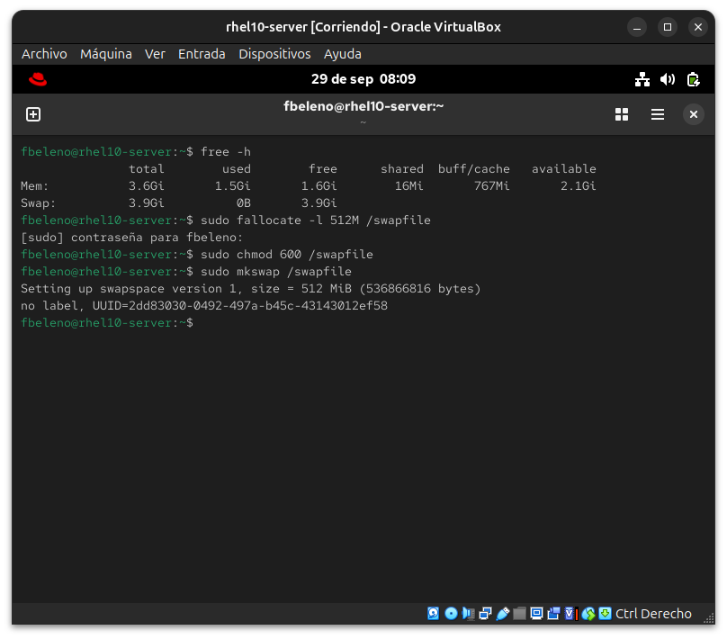
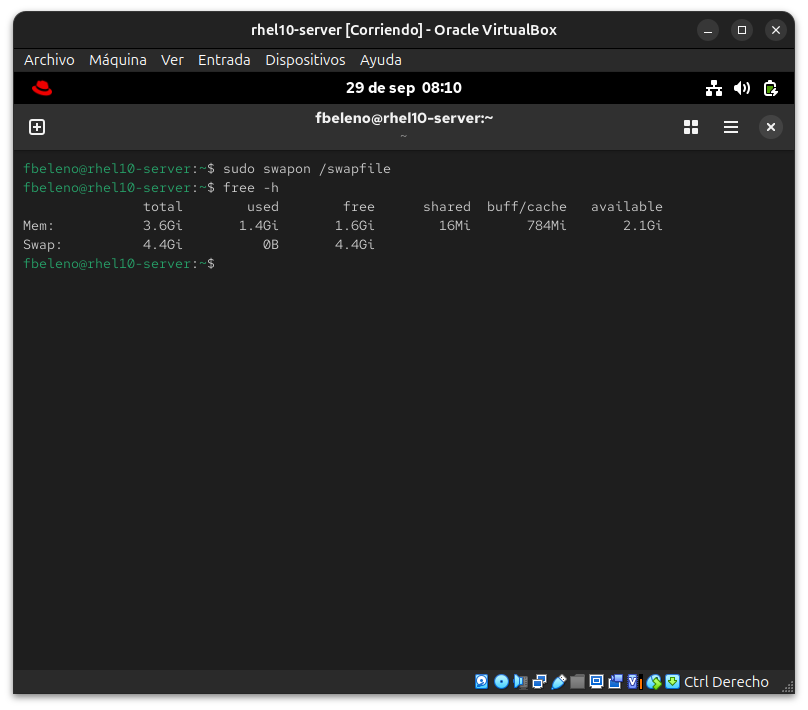
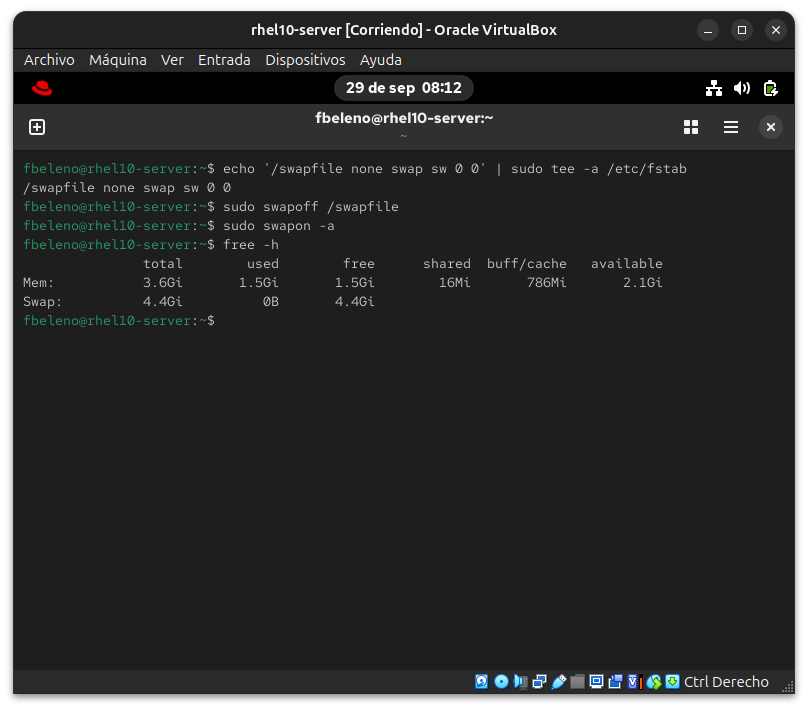
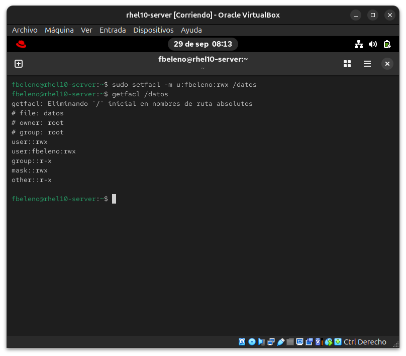
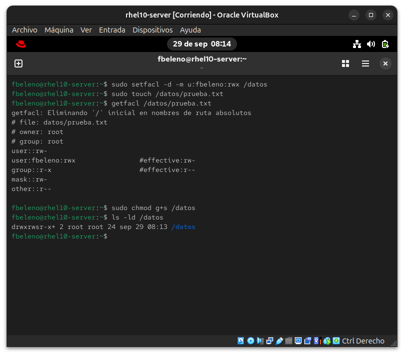

# Módulo 06 — Swap, ACLs (setfacl/getfacl), directorios set-GID

- Estado: Completado
- Fecha: 2026-09-29
- Versión: RHEL 10.2 (Coughlan)
- Objetivo diferencial frente a Fedora: ACLs y set-GID son conceptos
  genéricos ya vistos en Arch. Lo específico de RHEL acá es que **XFS
  soporta ACLs de forma nativa sin mount option extra** (`acl` viene
  implícito) — a diferencia de sistemas ext4 viejos donde había que
  agregarlo explícito en `fstab`.

## Concepto diferencial

**Swap adicional**: el sistema ya tiene swap vía LV (`rhel-swap`, visto en
el módulo 05). Acá se agrega swap **adicional** en un archivo, práctica
real cuando un servidor se queda corto de memoria sin rediseñar el
particionado original.

**ACLs**: `setfacl -m u:usuario:rwx archivo` agrega un permiso puntual
además del dueño/grupo/otros clásico; `getfacl` muestra el resultado;
`-d` en un directorio crea una ACL **default** que se hereda a los
archivos nuevos creados adentro.

**set-GID en directorios**: `chmod g+s directorio` hace que todo archivo
nuevo creado ahí herede el grupo del directorio, no el grupo primario del
usuario que lo crea. Combinado con ACLs default, es el patrón real para
carpetas compartidas de equipo.

Se usa `/datos` (el LV armado en el módulo 05) como terreno de pruebas
para ACLs y set-GID.

## Práctica guiada

```bash
# estado de memoria/swap actual
free -h

# swap adicional en archivo
sudo fallocate -l 512M /swapfile
sudo chmod 600 /swapfile
sudo mkswap /swapfile
sudo swapon /swapfile
free -h

# persistencia en fstab
echo '/swapfile none swap sw 0 0' | sudo tee -a /etc/fstab

# ACLs sobre /datos
sudo setfacl -m u:fbeleno:rwx /datos
getfacl /datos

# ACL default (herencia) sobre /datos
sudo setfacl -d -m u:fbeleno:rwx /datos
sudo touch /datos/prueba.txt
getfacl /datos/prueba.txt

# set-GID sobre /datos
sudo chmod g+s /datos
ls -ld /datos
```

## Hallazgos reales

1. **El swap ya existente (LV `rhel-swap`, módulo 05) confirmado con
   `free -h`**: 3.9Gi antes de agregar el swap de archivo. Tras
   `swapon /swapfile`, el total subió a 4.4Gi — la suma de ambos swaps
   funciona de forma transparente para el kernel, sin necesidad de
   priorizar uno sobre otro para este caso de uso.
2. **`setfacl` funcionó sobre `/datos` sin ninguna opción `acl` agregada
   al mount en `/etc/fstab`** (solo se usó `xfs defaults` en el módulo
   05) — confirma la teoría: XFS soporta ACLs nativamente, sin
   configuración extra, a diferencia de ext4 en sistemas viejos.
3. **La ACL default se heredó correctamente** al crear `prueba.txt`:
   `user:fbeleno:rwx` con `#effective:rw-` (sin ejecución, por el umask
   estándar aplicado también a ACLs en archivos nuevos — comportamiento
   esperado, no una limitación de la ACL en sí).
4. **`ls -ld` muestra set-GID y ACL en una sola línea**: `drwxrwsr-x+` —
   la `s` en la posición de ejecución de grupo confirma el set-GID, y el
   `+` al final indica que el archivo/directorio tiene ACLs más allá de
   los permisos clásicos. Señal rápida y confiable para detectar ambos
   mecanismos de un vistazo, sin correr `getfacl`.

## Evidencias

**01 — Estado de memoria/swap inicial**
`free -h` mostrando el swap existente (LV rhel-swap, 3.9Gi) y creación del archivo de swap con `fallocate`/`chmod`/`mkswap`.


**02 — swapon y confirmación**
`swapon /swapfile` y `free -h` confirmando el total sumado a 4.4Gi (hallazgo #1).


**03 — Persistencia en fstab**
Entrada agregada a `/etc/fstab`, `swapoff`/`swapon -a` confirmando que persiste igual tras un ciclo completo.


**04 — ACL puntual sobre /datos**
`setfacl -m u:fbeleno:rwx /datos` y `getfacl` mostrando el resultado, sin haber tocado el mount de XFS (hallazgo #2).


**05 — ACL default, herencia y set-GID**
ACL default aplicada, archivo nuevo heredándola (hallazgo #3), `chmod g+s` y `ls -ld` mostrando `drwxrwsr-x+` (hallazgo #4).


## Pendientes

Ninguno — módulo cerrado.
