# Módulo 07 — NFS y autofs con `rhel10-client`

- Estado: Completado
- Fecha: 2026-09-30
- Versión: RHEL 10.2 (Coughlan)
- Objetivo diferencial frente a Fedora: NFS/autofs no se cubrió en el
  curso de Fedora — contenido nuevo real. El ángulo específico de RHEL es
  que **SELinux enforcing bloquea NFS por defecto** salvo que se usen los
  booleans correctos o el contexto SELinux adecuado en el directorio
  exportado, algo que en laboratorios con SELinux permissive ni se nota.

## Concepto diferencial

**Servidor NFS**: paquete `nfs-utils`, exports declarados en `/etc/exports`
(opciones `rw`/`ro`, `sync`/`async`, `no_root_squash` vs el squash por
defecto que mapea root remoto a `nobody`), servicio `nfs-server`, y el
puerto/servicio abierto en `firewalld` (`--add-service=nfs`).

**Cliente manual vs autofs**: montar a mano con `mount -t nfs` funciona
pero no es lo que evalúa el examen — `autofs` (`/etc/auto.master` + un
mapa indirecto en `/etc/auto.misc`) monta bajo demanda y desmonta solo
tras inactividad, el patrón real esperado en el RHCSA.

**SELinux**: con SELinux enforcing (default en RHEL), compartir un
directorio por NFS puede requerir ajustar el contexto SELinux del
directorio exportado o habilitar booleans como `nfs_export_all_rw`,
según el escenario.

## Práctica guiada

### 1. Crear `rhel10-client`

VM nueva en VirtualBox: 1024 MB RAM, 1 vCPU, 15 GB disco, misma ISO de
RHEL 10.2. Instalación **mínima** (sin GUI, más liviana para 1 GB de
RAM), usuario `fbeleno` con sudo, hostname `rhel10-client.local`.
Registro con `subscription-manager` como cualquier sistema nuevo (cada
VM consume su propio slot de la suscripción, ver módulo 00).

### 2. Red entre las dos VMs

El adaptador NAT de VirtualBox aísla cada VM en su propia red — no se
ven entre sí. Se agregó un **segundo adaptador** en modo **Red Interna**
(`redlab`) a ambas VMs, con IP estática:

```bash
# en rhel10-server
sudo nmcli con add type ethernet ifname enp0s8 con-name redlab ipv4.addresses 192.168.100.1/24 ipv4.method manual
sudo nmcli con up redlab

# en rhel10-client
sudo nmcli con add type ethernet ifname enp0s8 con-name redlab ipv4.addresses 192.168.100.2/24 ipv4.method manual
sudo nmcli con up redlab
```

Verificado con `ping` bidireccional entre `192.168.100.1` y `192.168.100.2`.

### 3. Servidor NFS (`rhel10-server`)

```bash
sudo dnf install -y nfs-utils
sudo mkdir -p /export/compartido
sudo chmod 755 /export/compartido
echo '/export/compartido 192.168.100.0/24(rw,sync,no_root_squash)' | sudo tee -a /etc/exports
sudo systemctl enable --now nfs-server
sudo exportfs -rav
sudo firewall-cmd --add-service=nfs --permanent
sudo firewall-cmd --add-service=rpc-bind --permanent
sudo firewall-cmd --add-service=mountd --permanent
sudo firewall-cmd --reload
```

### 4. Cliente NFS (`rhel10-client`)

```bash
sudo dnf install -y nfs-utils autofs
showmount -e 192.168.100.1

# montaje manual de prueba
sudo mkdir -p /mnt/compartido
sudo mount -t nfs 192.168.100.1:/export/compartido /mnt/compartido
df -h /mnt/compartido

# prueba de escritura real
echo "hola desde rhel10-client" | sudo tee /mnt/compartido/prueba-nfs.txt
sudo umount /mnt/compartido

# autofs (montaje bajo demanda)
echo '/mnt/auto /etc/auto.misc' | sudo tee -a /etc/auto.master
echo 'compartido -rw,soft 192.168.100.1:/export/compartido' | sudo tee -a /etc/auto.misc
sudo systemctl enable --now autofs
ls /mnt/auto/compartido
mount | grep compartido
```

## Hallazgos reales

1. **NAT aísla cada VM por completo, incluso entre VMs del mismo host**:
   `rhel10-client` arrancó con la misma IP (`10.0.2.15/24`) que
   `rhel10-server` ya tenía, porque NAT crea una red privada por VM,
   solo visible desde el host. Hubo que agregar un segundo adaptador en
   modo Red Interna para que las VMs se vieran entre sí — un paso que la
   teoría no mencionaba porque asume una topología de red ya resuelta.
2. **`rhel10-client` nunca se había registrado con `subscription-manager`**
   — el mismo error del módulo 00 ("No hay repositorios habilitados"),
   pero esta vez en una VM nueva. Confirma que el registro es por
   sistema, no por "cuenta" a nivel abstracto: cada VM necesita el suyo.
3. **`no_root_squash` funciona exactamente como predice la teoría**:
   escribiendo un archivo como root desde `rhel10-client` (`sudo tee`),
   el archivo apareció en `rhel10-server` con dueño `root:root`, no
   `nobody:nobody`. Sin esa opción en `/etc/exports`, hubiera quedado
   squasheado.
4. **Los módulos de kernel NFS/RPC se cargan bajo demanda** en el primer
   `mount -t nfs`, no vienen precargados — visible en el log del primer
   montaje manual (`RPC: Registered udp/tcp transport module`, etc.).
5. **NFSv4.2 se negoció automático sin configuración explícita**:
   `mount | grep compartido` muestra `type nfs4 (...,vers=4.2,...)` —
   no hizo falta forzar la versión como en configuraciones NFSv3 viejas.
6. **`autofs` montó bajo demanda con solo un `ls`**, sin correr `mount` a
   mano — confirma el comportamiento esperado de montaje transparente al
   primer acceso.

## Evidencias

**01 — Red interna configurada en ambas VMs**
Configuración de VirtualBox: Adaptador 2 en "Red interna" (`redlab`), en `rhel10-server` y en `rhel10-client`.
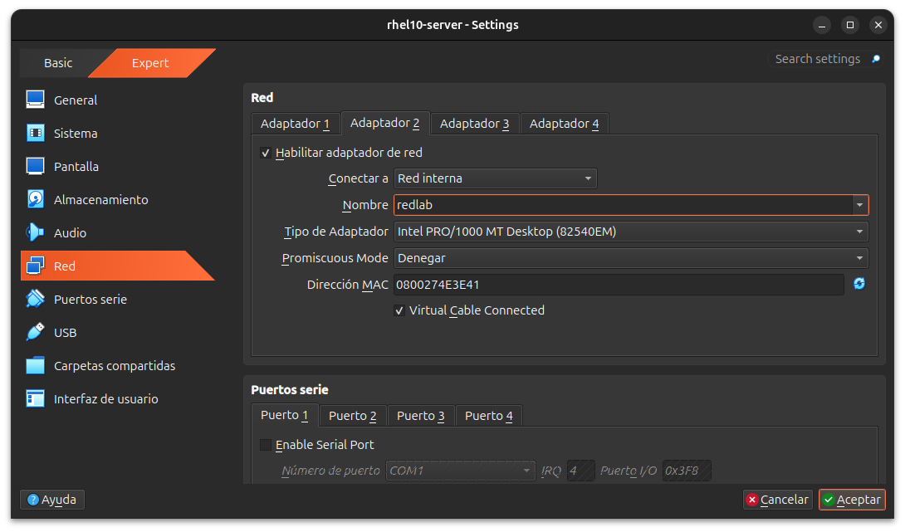
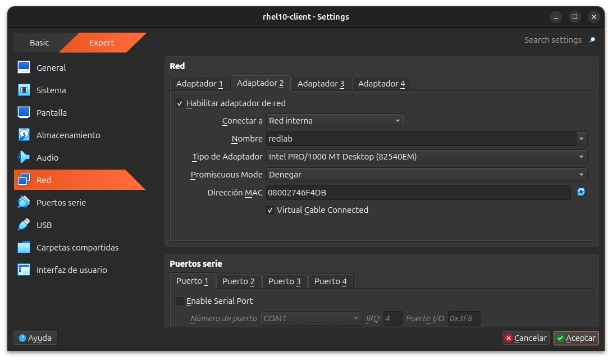

**02 — IP estática y conectividad bidireccional**
`nmcli con add`/`con up` en ambas VMs, y `ping` en las dos direcciones confirmando conectividad real por la red interna (hallazgo #1).
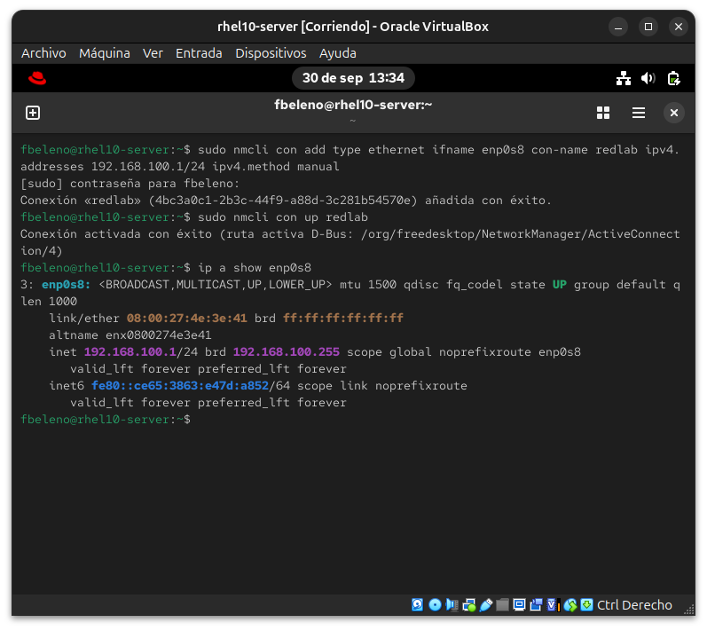
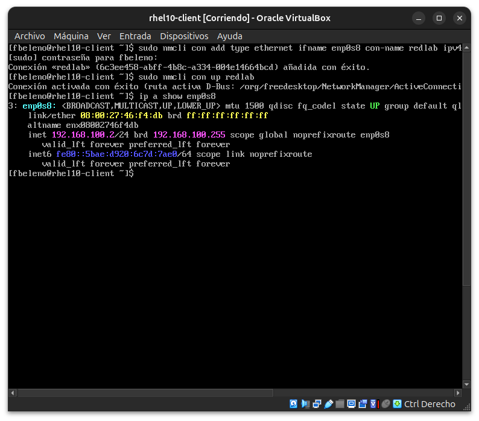
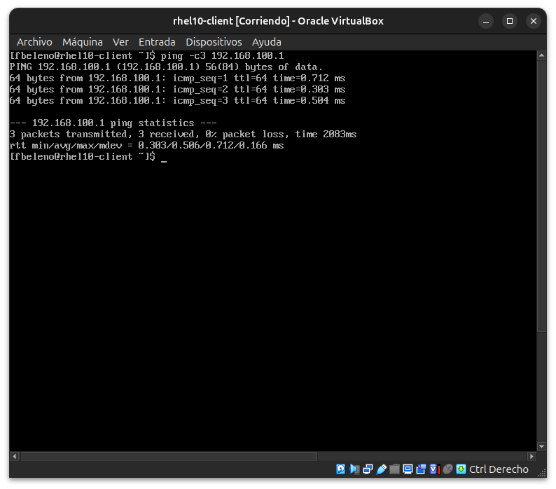
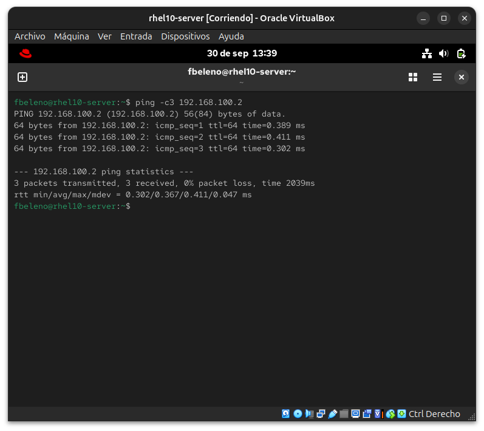

**03 — Registro de rhel10-client**
El mismo error de `dnf` sin registrar que vimos en el módulo 00, esta vez en la VM cliente (hallazgo #2), el registro exitoso, y `nfs-utils`/`autofs` instalados después.
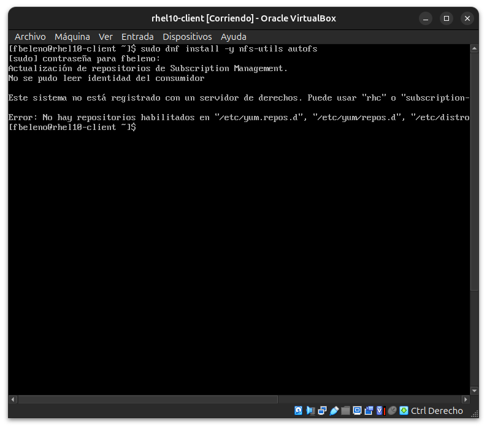
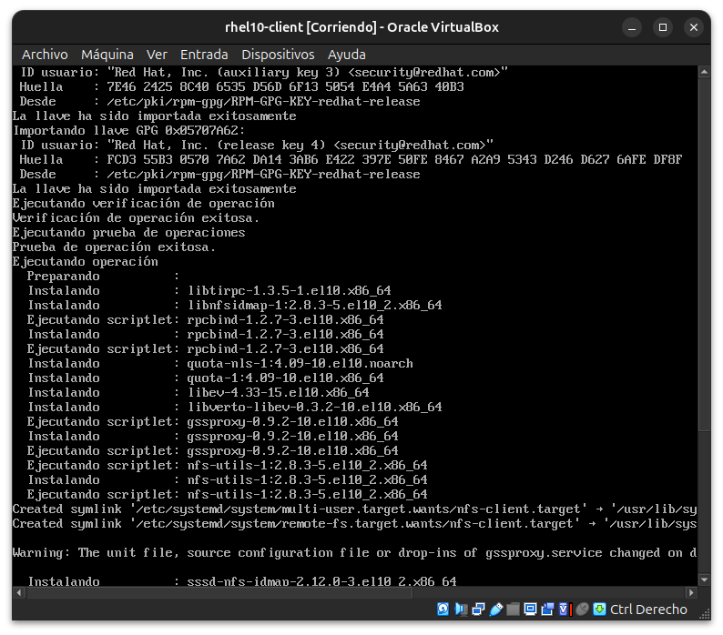
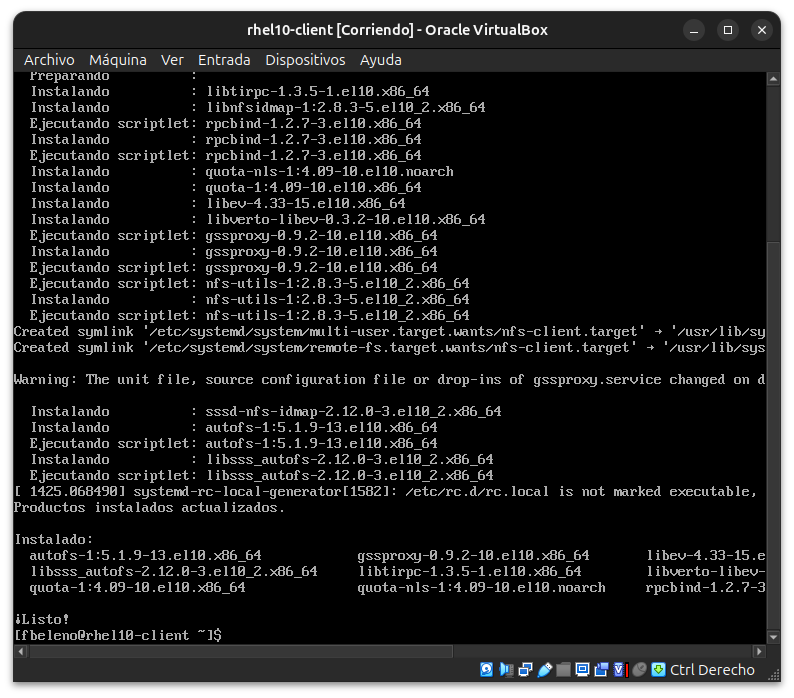

**04 — Servidor NFS configurado**
`nfs-utils` instalado en `rhel10-server`, `/etc/exports` con la red específica, `nfs-server` habilitado y `exportfs -rav` confirmando el export.
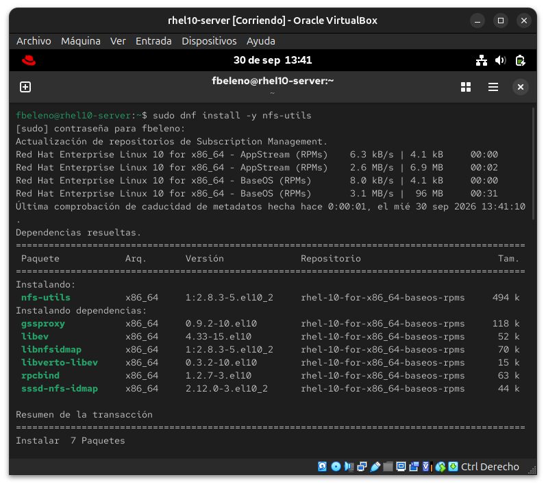
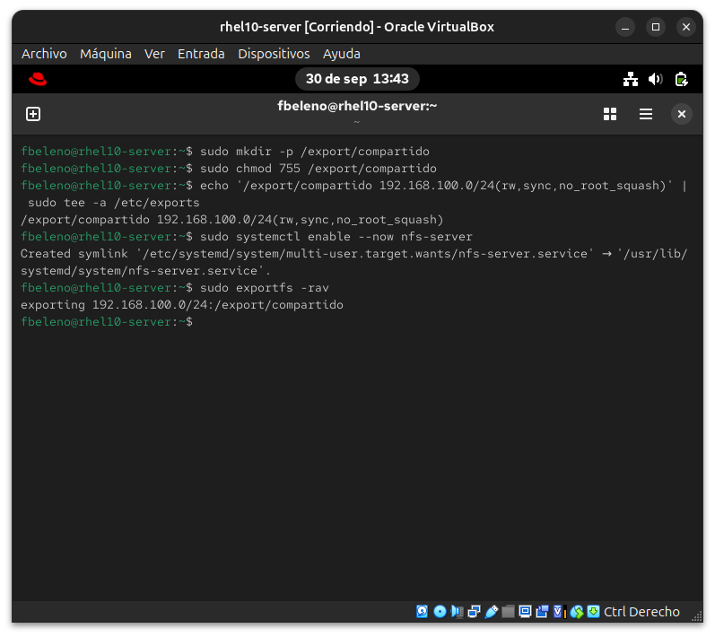

**05 — Firewall abierto para NFS**
`firewall-cmd --add-service` para nfs/rpc-bind/mountd, y `--list-services` confirmando el resultado.
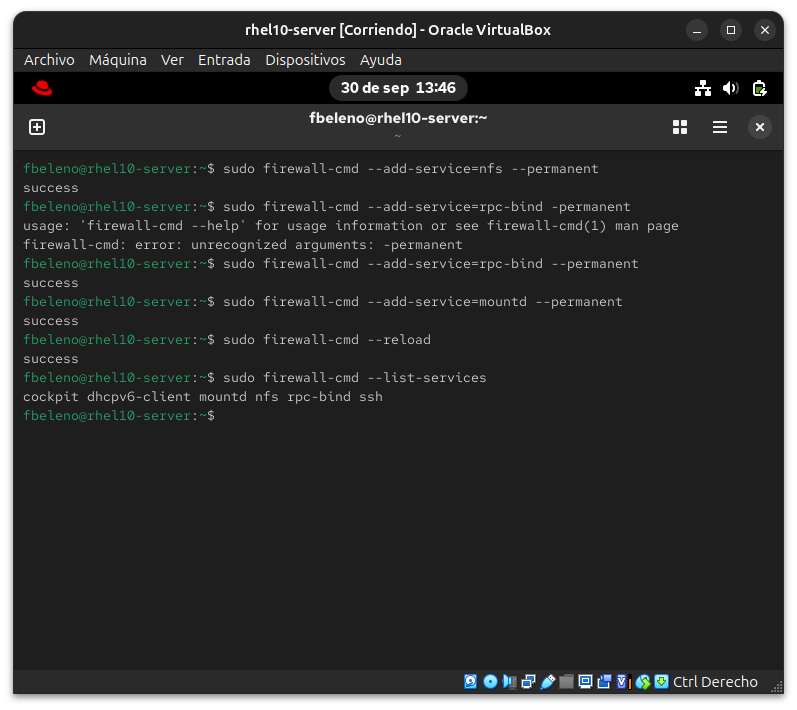

**06 — Montaje manual y escritura de prueba**
Montaje manual en el cliente, `showmount -e`, carga de módulos de kernel bajo demanda (hallazgo #4), y escritura del archivo de prueba como root.
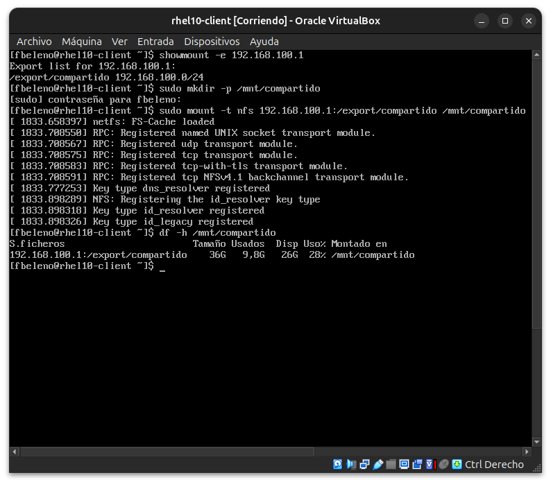
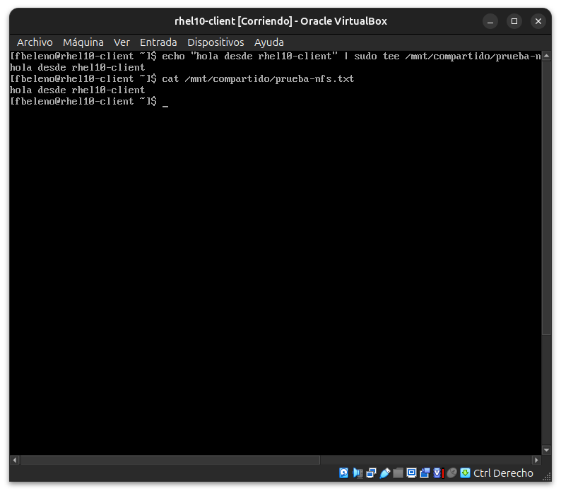

**07 — Verificación cruzada en el servidor**
El archivo de prueba visto desde `rhel10-server`, con dueño `root:root` — confirma `no_root_squash` (hallazgo #3).
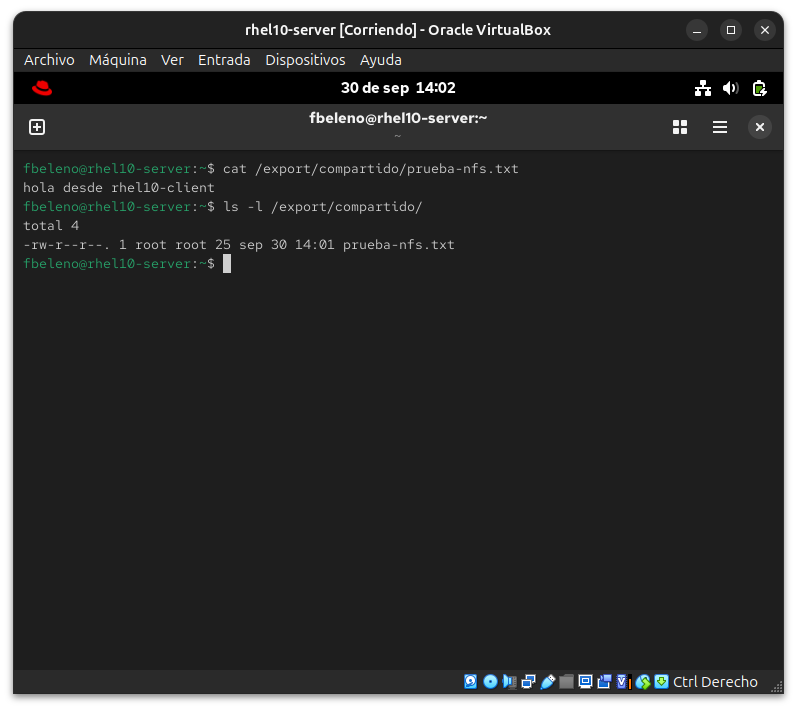

**08 — autofs montando bajo demanda**
`/etc/auto.master`/`auto.misc` configurados, `autofs` habilitado, montaje automático al hacer `ls` (hallazgo #6).
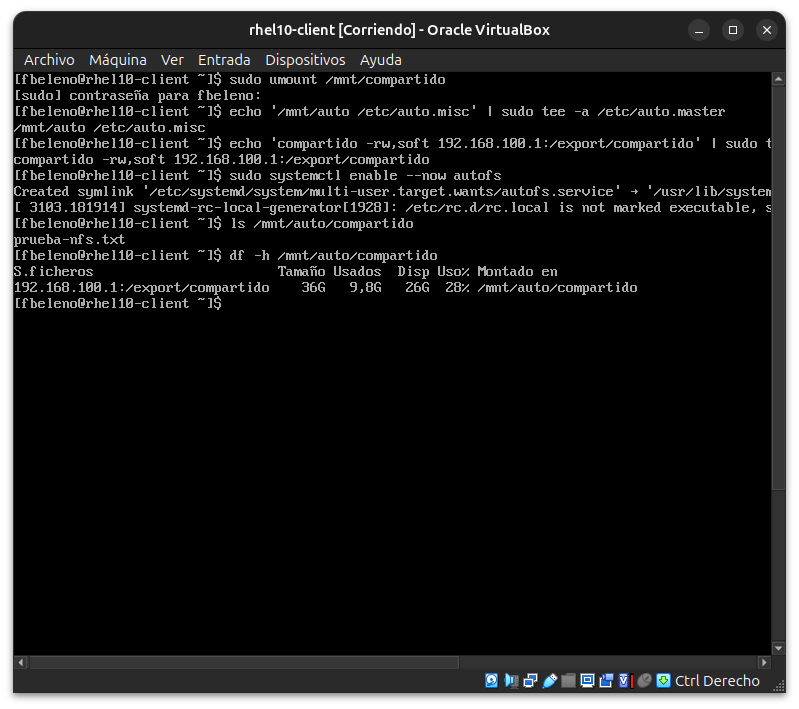

**09 — NFSv4.2 negociado automático**
`mount | grep compartido` confirmando `type nfs4 (...,vers=4.2,...)` sin haberlo forzado (hallazgo #5).
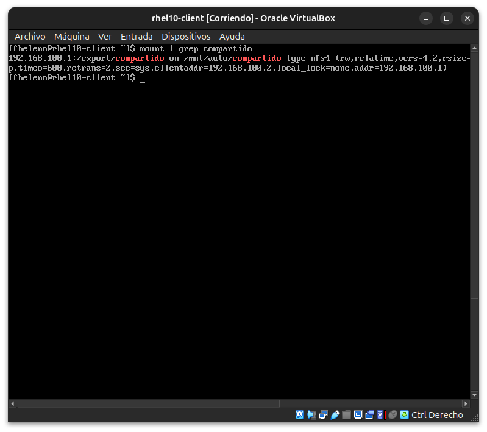

## Pendientes

Ninguno — módulo cerrado. Falta observar el desmonte automático de
`autofs` tras el timeout de inactividad (5 min por defecto) — no se
esperó ese tiempo durante la práctica, queda como verificación opcional.
