# Módulo 08 — `/etc/fstab` corrupto — recuperación desde rescate 🔧 Break & Fix

- Estado: Completado
- Fecha: 2026-09-30
- Versión: RHEL 10.2 (Coughlan)
- Objetivo diferencial frente a Fedora: el mecanismo de rescate (systemd
  emergency target, `journalctl -xb`, remount de `/` en RW) es genérico
  de systemd, ya visto en Arch. Lo específico de RHEL/RHCSA es el flujo
  exacto que espera el examen: loguear en emergency mode con la
  contraseña de root, remount, editar `fstab`, `daemon-reload`, y
  confirmar con reboot.

## Concepto diferencial

Un error de tipeo o un UUID inventado en `/etc/fstab` puede dejar el
sistema sin bootear completo, cayendo en **emergency mode** de systemd —
uno de los escenarios más comunes y más temidos del RHCSA. La cuenta root
está deshabilitada para login normal (decisión del módulo 00), pero el
modo emergencia de systemd **sí pide contraseña de root** — sin ella, no
hay forma de entrar.

Cierra la Fase II (Almacenamiento) del curso, construyendo sobre el LV
`/datos` armado en el módulo 05.

## Cambio deliberado

1. Establecer contraseña de root (necesaria para emergency mode):
   `sudo passwd root`.
2. Respaldar el `/etc/fstab` real antes de tocarlo.
3. Corromper la entrada de `/datos` — UUID inventado que no corresponde
   a ningún filesystem real.
4. Reiniciar la VM.

```bash
sudo passwd root
sudo cp /etc/fstab /etc/fstab.bak
cat /etc/fstab
```

## Síntoma

Al reiniciar, el sistema se queda colgado en la pantalla de carga
(spinner de Plymouth) más tiempo del normal — está esperando a que monte
`/datos` hasta agotar el timeout del mount (los warnings cosméticos de
`vmwgfx`/drivers del módulo 00 reaparecen en el camino, sin relación con
el problema real). Después cae a:

```
You are in emergency mode. After logging in, type "journalctl -xb" to view
system logs, "systemctl reboot" to reboot, or "exit" to continue bootup.
Give root password for maintenance
(or press Control-D to continue):
```

## Diagnóstico y recuperación

**Observación**: pide contraseña de root — funcionó porque se estableció
una al principio del módulo (`sudo passwd root`); sin ese paso previo no
habría forma de entrar.

**Log consultado**: `journalctl -xb | grep -i datos` mostró:
- La activación de LVM **sí funcionó**: `PV /dev/sdb online, VG vg_datos
  is complete`, `lvm-activate-vg_datos.service` terminó exitosamente.
- Lo que falló fue específicamente **`datos.mount`** (la unidad que
  systemd genera a partir de la línea de `/etc/fstab`): `Dependency
  failed for datos.mount - /datos`, `Job datos.mount/start failed`.

**Hipótesis**: el UUID de la línea de `/datos` en `fstab` no corresponde
a ningún filesystem real — descartado por diseño, ya que fue el cambio
deliberado del módulo.

**Hallazgo real (verdad sobre guión)**: `mount | grep " / "` reveló que
`/` **ya estaba montada en `rw`** dentro del emergency mode de RHEL 10.2
(`/dev/mapper/rhel-root on / type xfs (rw,relatime,...)`). Esto
contradice la instrucción genérica, repetida en mucha documentación de
RHCSA, de que hay que hacer `mount -o remount,rw /` antes de poder
editar `fstab` — en esta versión no hizo falta, se pudo editar directo.

**Prueba de causa raíz**: un primer intento de `sed -i 's/UUID=.../UUID=.../' /etc/fstab`
con el UUID viejo y el nuevo completos **no aplicó el cambio** (el
`cat` posterior mostró el archivo sin modificar) — probablemente el
comando se cortó o hubo un problema de escape de caracteres al ser tan
largo. Se resolvió con un patrón más robusto, anclado por contexto en
vez de por el string completo del UUID:
```bash
sed -i '/\/datos/s/UUID=[^ ]*/UUID=f84245f4-c997-417d-bc80-8ac5064ecc7b/' /etc/fstab
```

**Solución aplicada**: UUID corregido, `systemctl daemon-reload`, y
`systemctl default` para completar el arranque sin necesitar un reboot
completo adicional.

**Validación**: boot completó hasta la pantalla de login gráfica de
GNOME con normalidad. Tras loguear, `df -h /datos` y `mount | grep
datos` confirman el LV montado en 3.0G (tamaño extendido del módulo 05),
3% de uso — datos intactos, nada se perdió.

## Impacto y riesgos

Un solo carácter mal escrito (o copiado/pegado mal) en un UUID de
`/etc/fstab` puede dejar un servidor de producción completo sin arrancar
automáticamente, requiriendo intervención manual en consola — no basta
con SSH, porque el sistema nunca llega a tener red funcional en
emergency mode (si la interfaz de red depende de un servicio posterior
en el arranque). En un entorno real, esto significa downtime hasta que
alguien con acceso físico/consola de virtualización resuelva el
problema.

## Cómo evitar recurrencia

- Usar siempre `blkid`/`lsblk -f` para copiar el UUID real en vez de
  escribirlo a mano o editarlo con `sed` sin verificar el resultado.
- Agregar `nofail` a montajes no críticos en `fstab` (por ejemplo,
  `/datos` podría tener `nofail` ya que no es parte del sistema base) —
  así un fallo de montaje no bloquea el arranque completo, solo deja esa
  ruta sin montar.
- Después de cualquier edición manual de `fstab`, validar con
  `findmnt --verify` **antes** de reiniciar, para detectar errores sin
  necesidad de llegar al emergency mode.
- Mantener siempre una copia de `fstab` conocida-buena (`fstab.bak`)
  antes de tocarlo, como se hizo en este módulo.

## Evidencias

**01 — Contraseña de root establecida**
`sudo passwd root` exitoso — requisito para poder entrar a emergency mode más adelante.
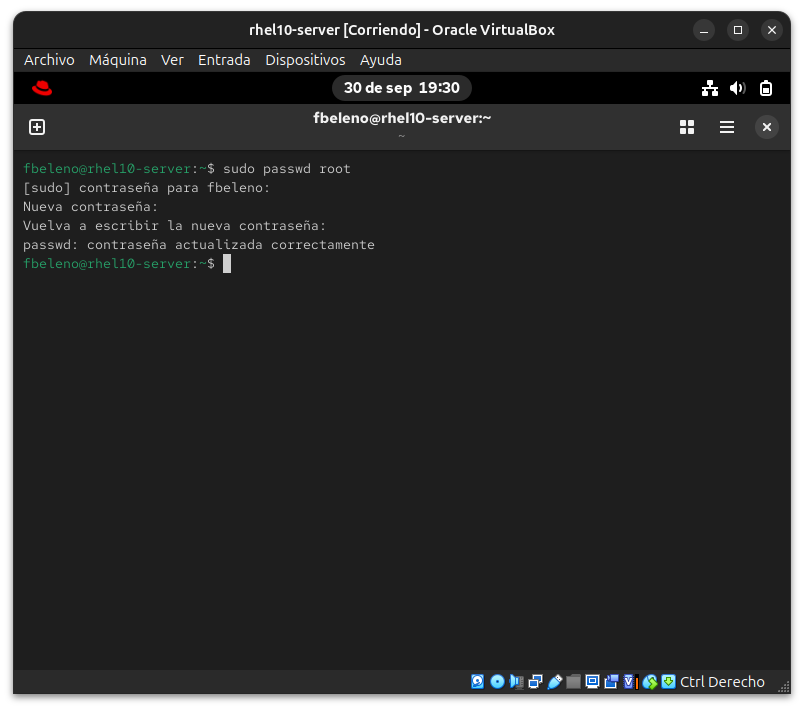

**02 — Backup y fstab original**
`cp /etc/fstab /etc/fstab.bak` y el contenido original completo, con las 5 entradas de los módulos 05/06.
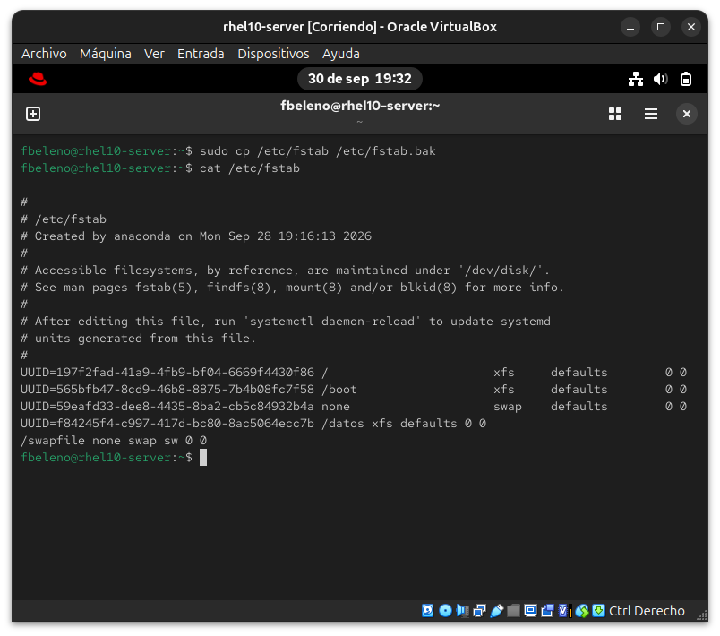

**03 — Cambio deliberado: UUID corrompido**
`sed` reemplazando el UUID real de `/datos` por uno inventado, y confirmación con `cat`.
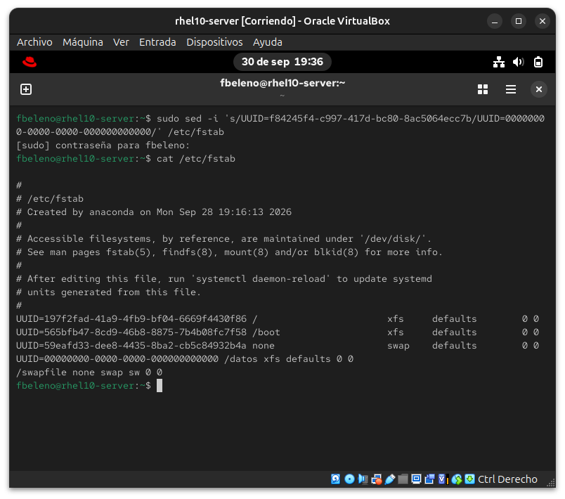

**04 — Boot colgado (síntoma inicial)**
El arranque se queda en el spinner de carga más tiempo del normal, esperando el timeout del mount fallido.
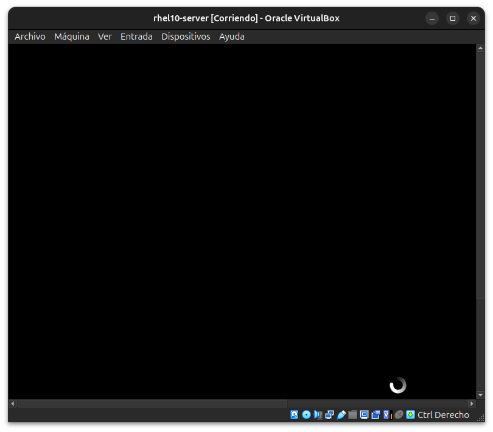

**05 — Pantalla de emergency mode**
Mensaje exacto de systemd pidiendo contraseña de root para mantenimiento — el síntoma central del módulo.
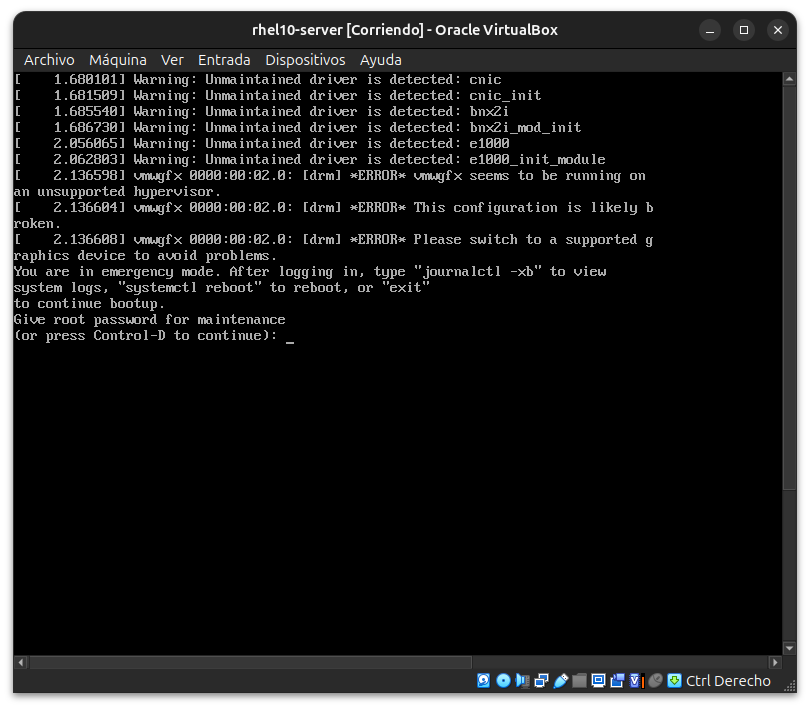

**06 — Login en emergency mode**
Sesión de root abierta en modo mantenimiento (`root@rhel10-server:~#`).
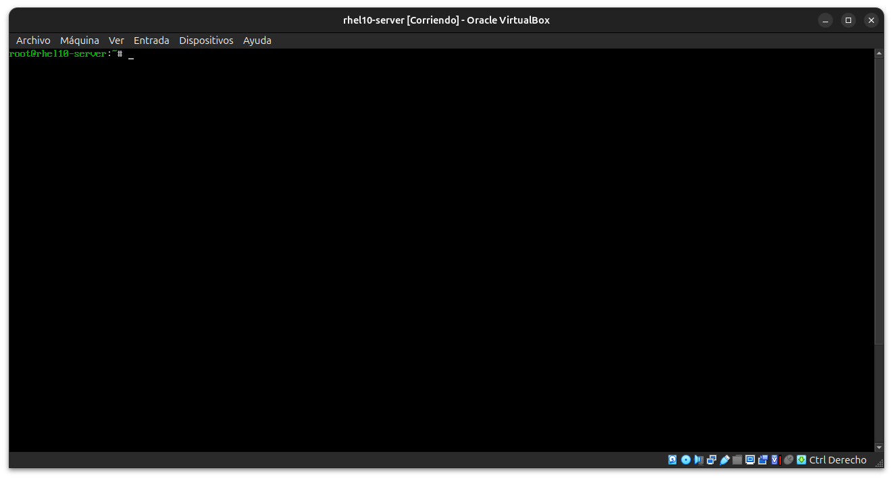

**07 — Diagnóstico con journalctl**
`journalctl -xb | grep -i datos` mostrando que LVM activó bien pero `datos.mount` falló, y `mount` confirmando que `/` ya estaba en `rw` (hallazgo real sobre el remount).
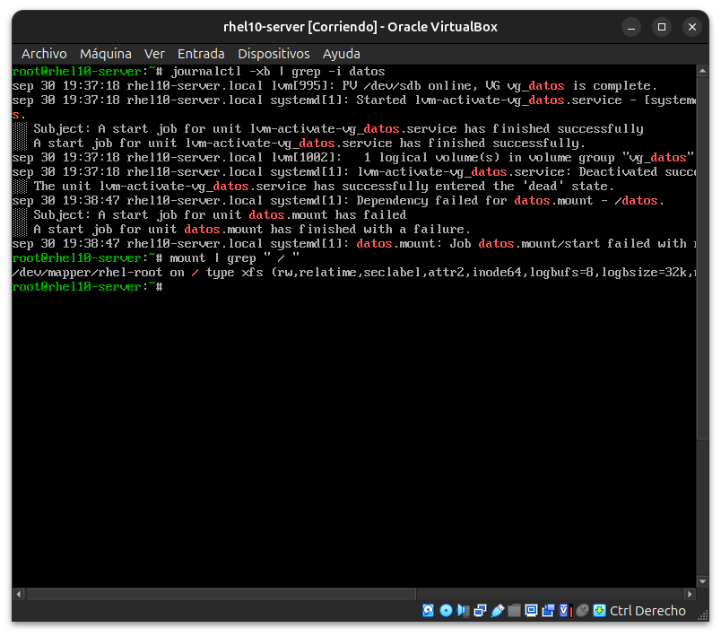

**08 — Primer intento de fix fallido**
El `sed` con el UUID completo no aplicó el cambio — `cat` muestra el archivo todavía roto.
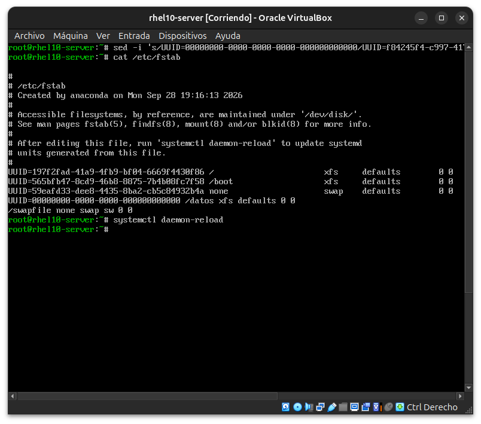

**09 — Fix aplicado correctamente**
El segundo `sed`, anclado por `/datos` en vez del UUID completo, corrigió el archivo — confirmado con `cat` y `daemon-reload`.
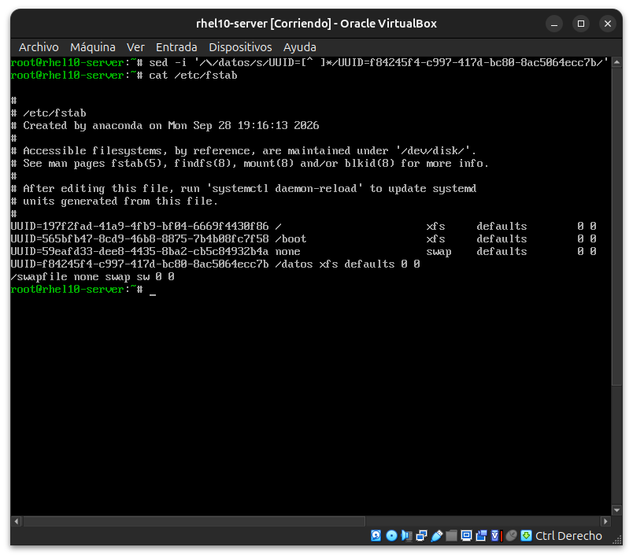

**10 — Boot completo tras el fix**
Pantalla de login gráfica normal de GNOME, sin necesidad de un reboot completo adicional.
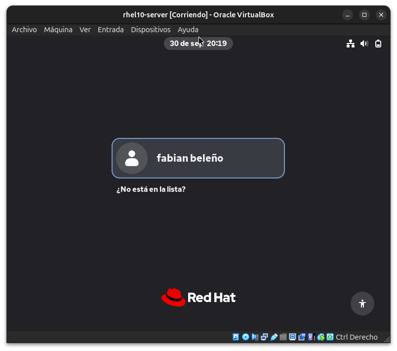

**11 — Validación final**
`df -h /datos` y `mount | grep datos` confirmando el LV montado en 3.0G, datos intactos.
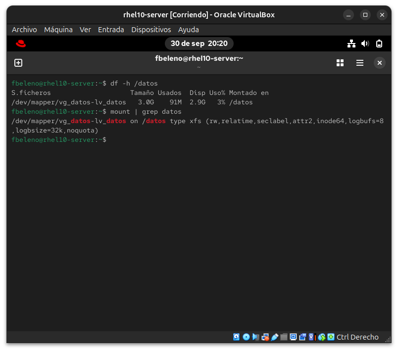

## Pendientes

Ninguno — módulo cerrado. Cierra la Fase II completa del curso.
