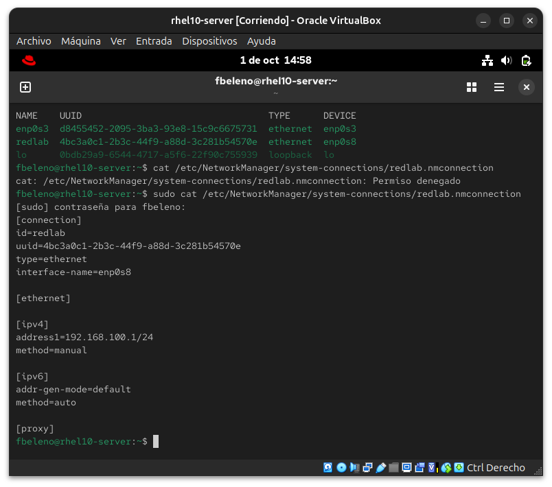
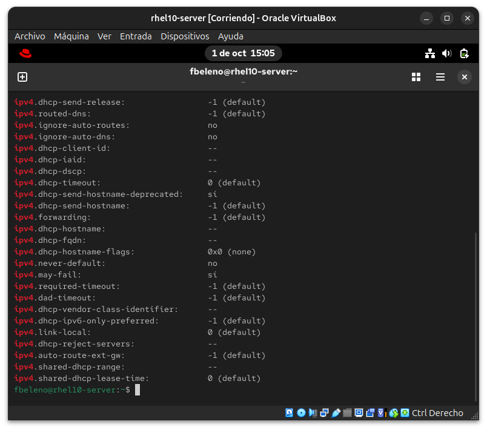
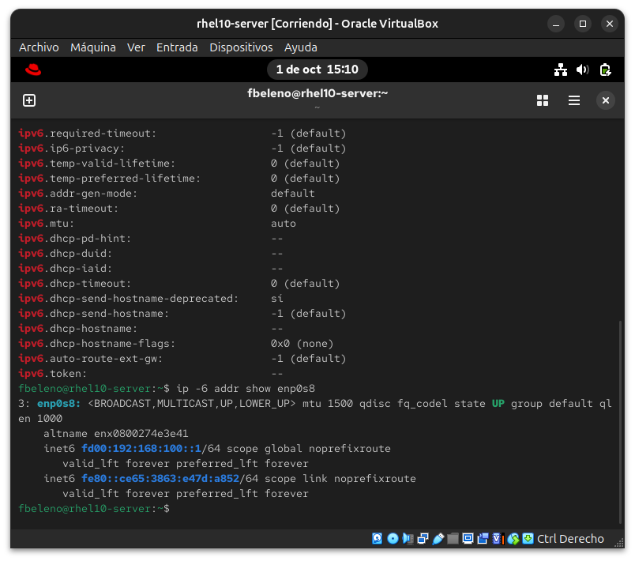
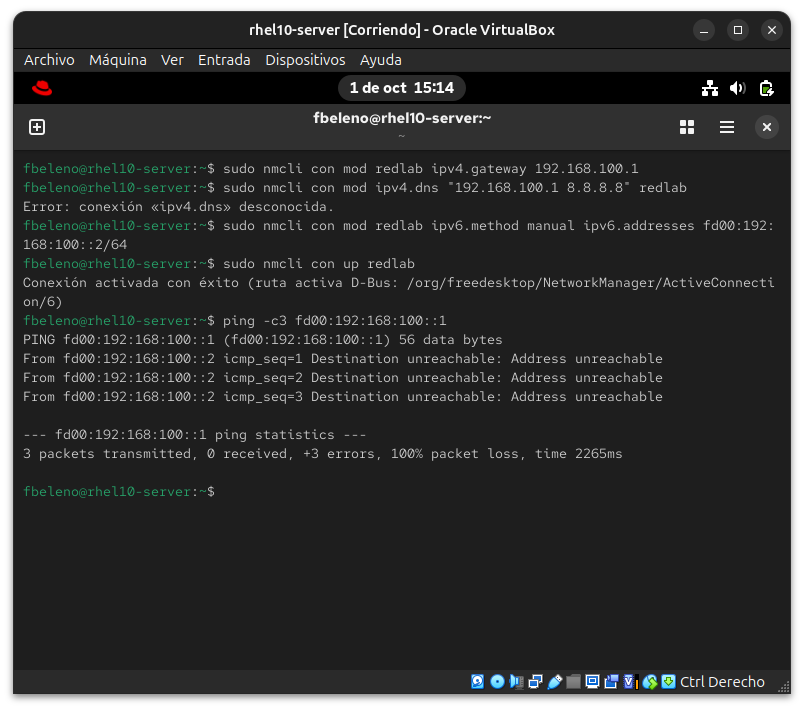
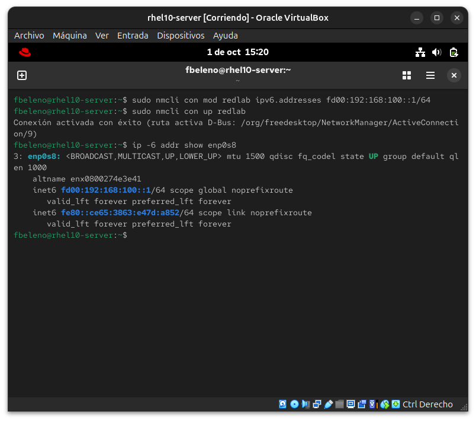
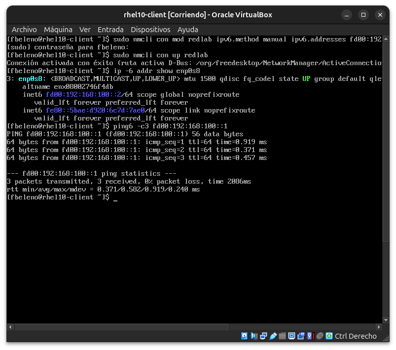

# Módulo 09 — `nmcli` IPv4/IPv6 estático

- Estado: Completado
- Fecha: 2026-10-01
- Versión: RHEL 10.2 (Coughlan)
- Objetivo diferencial frente a Fedora: `nmcli` en sí ya se conoce. Lo
  específico de RHEL para el examen es que los viejos scripts
  `/etc/sysconfig/network-scripts/ifcfg-*` están **deprecados desde
  RHEL 8/9** — el backend por defecto ahora es **keyfile**
  (`/etc/NetworkManager/system-connections/*.nmconnection`), y el RHCSA
  espera manejo de `nmcli`/`nmtui`, no edición manual de esos archivos.

## Concepto diferencial

En el módulo 07 ya se usó `nmcli con add ... ipv4.addresses ...
ipv4.method manual` para una IP estática simple. Acá se completa el
perfil: dirección + prefijo + gateway + DNS en un solo lugar, más la
contraparte IPv6 estática.

**IPv4 estático completo**: `ipv4.addresses`, `ipv4.gateway`,
`ipv4.dns`, todo en el mismo `nmcli con mod`.

**IPv6 estático**: mismo patrón con `ipv6.method manual` —
**explícito**, si no NetworkManager intenta autoconfiguración SLAAC
igual aunque se declare una dirección IPv6 estática.

**Verificación**: `nmcli con show <nombre>`, `nmcli device show`, `ip
-4/-6 addr`, y revisar (sin editar a mano) el archivo `.nmconnection`
generado para entender qué escribió `nmcli` realmente.

## Práctica guiada

```bash
# estado actual de conexiones
nmcli con show
cat /etc/NetworkManager/system-connections/redlab.nmconnection

# completar IPv4 estático en la conexión redlab (módulo 07) con gateway y DNS
sudo nmcli con mod redlab ipv4.gateway 192.168.100.1
sudo nmcli con mod redlab ipv4.dns "192.168.100.1 8.8.8.8"
sudo nmcli con up redlab

# agregar IPv6 estático a la misma conexión
sudo nmcli con mod redlab ipv6.method manual ipv6.addresses fd00:192:168:100::1/64
sudo nmcli con up redlab

# verificación
nmcli con show redlab
ip -4 addr show enp0s8
ip -6 addr show enp0s8
cat /etc/NetworkManager/system-connections/redlab.nmconnection
```

## Hallazgos reales

1. **Los archivos `.nmconnection` (keyfile) requieren root para leerse**:
   `cat` sin `sudo` sobre `/etc/NetworkManager/system-connections/redlab.nmconnection`
   dio "Permiso denegado" — a diferencia de los viejos `ifcfg-*` que eran
   legibles por cualquiera, el backend keyfile por defecto en RHEL 8+
   restringe el acceso (pueden contener credenciales Wi-Fi/VPN en otros
   escenarios, de ahí el endurecimiento).
2. **Error humano real, no de la herramienta**: al replicar la config en
   la segunda VM, se corrieron los comandos de la IP `::2` en la ventana
   equivocada (`rhel10-server`, no `rhel10-client`), pisando la propia
   dirección `::1` del servidor y rompiendo la conectividad hasta
   notarlo por el título de la ventana. Lección operativa real para
   cuando se trabaja con múltiples VMs simultáneas: confirmar el título
   de la ventana antes de pegar comandos, no asumir por el orden de las
   ventanas en pantalla.
3. **Typo real de IPv4→IPv6**: al corregir la dirección del servidor, se
   escribió `/24` (el prefijo "de memoria" de IPv4) en vez de `/64`
   (el prefijo estándar de esta red IPv6) — `nmcli` lo aceptó sin
   quejarse (es solo un número de prefijo válido), y recién se notó al
   revisar `ip -6 addr show`. Confirma que `nmcli` no valida si el
   prefijo "tiene sentido" para el escenario, solo que sea sintácticamente
   válido.
4. **`ipv6.method manual` no quita la IPv6 link-local automática**:
   `ip -6 addr show` siempre muestra además una `fe80::.../64` con scope
   `link` — es generada automáticamente por el kernel para cada interfaz
   con IPv6 habilitado, independiente de la configuración estática; no
   hay que confundirla con un error de configuración.

## Evidencias

**01 — Conexión redlab antes de los cambios**
`nmcli con show` listando las tres conexiones, y el archivo `.nmconnection` real solo legible con `sudo` (hallazgo #1), con IPv4 manual pero sin gateway/DNS, e IPv6 todavía en `auto`.


**02 — IPv4 completo: gateway y DNS**
`nmcli con mod` agregando gateway y DNS, confirmado con `nmcli con show redlab | grep ipv4`.


**03 — IPv6 estático en el servidor**
`ipv6.method manual` + `ipv6.addresses`, confirmado con `grep ipv6` e `ip -6 addr show` (incluye la link-local automática, hallazgo #4).


**04 — Hallazgo: comando corrido en la VM equivocada**
Los comandos de la IP `.2` ejecutados por error en `rhel10-server`, rompiendo su propia dirección `::1` (hallazgo #2).


**05 — Typo /24 en vez de /64, corregido**
Primer intento con `/24` (hallazgo #3) y la corrección a `/64` confirmada con `ip -6 addr show`.


**06 — IPv6 estático en el cliente y conectividad confirmada**
`rhel10-client` con `::2/64` configurado, y `ping6` exitoso hacia `rhel10-server` (`::1`) — objetivo del módulo cumplido.


## Pendientes

Ninguno — módulo cerrado.
