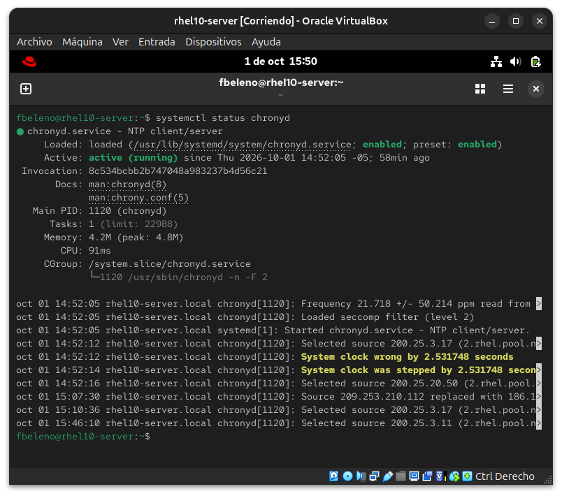
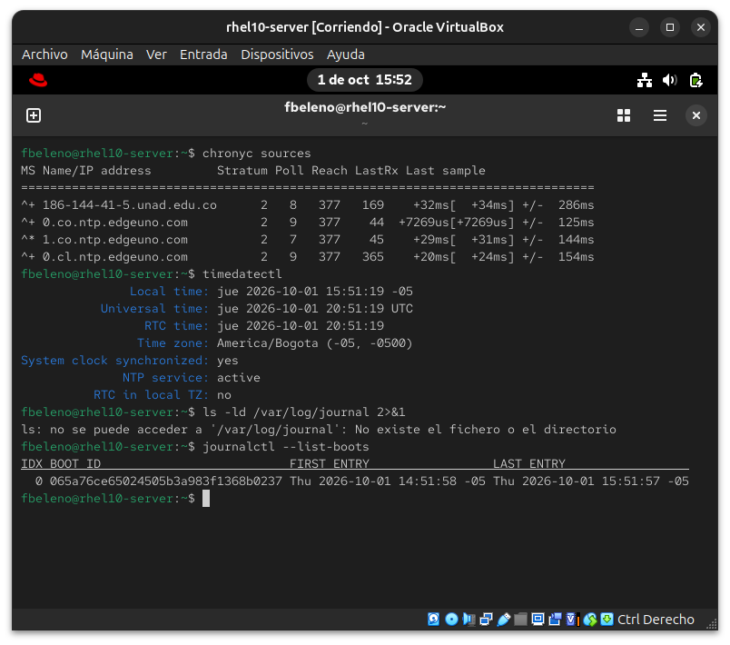

# Módulo 11 — `chrony` y journal persistente

- Estado: En progreso
- Fecha: 2026-10-01
- Versión: RHEL 10.2 (Coughlan)
- Objetivo diferencial frente a Fedora: la lógica de `chrony` es la
  misma que en Fedora. Lo que se comprueba acá es si el journal de
  systemd es persistente o volátil por defecto en una instalación
  Server/GUI de RHEL — a diferencia de Fedora Workstation, que suele
  traer journal persistente de fábrica.

## Concepto diferencial

`chrony` es el servicio de sincronización horaria por defecto en RHEL
(sucesor de `ntpd`). `chronyc sources` muestra con qué servidores está
sincronizando y la calidad de esa sincronización; `chronyc tracking` da
el detalle del offset actual.

**Journal persistente**: por defecto, si no existe `/var/log/journal/`,
`systemd-journald` guarda todo en `/run/log/journal` (tmpfs, se borra en
cada reboot). Crear el directorio con los permisos correctos
(`systemd-tmpfiles --create --prefix /var/log/journal`) y reiniciar el
servicio lo vuelve persistente en disco. `journalctl --list-boots`
revela cuántos arranques distintos tiene registrados — con journal
volátil, después de varios reboots solo aparece el boot actual.

## Práctica guiada

```bash
# estado de chrony
systemctl status chronyd
chronyc sources
timedatectl

# estado del journal
ls -ld /var/log/journal 2>&1
journalctl --list-boots

# hacerlo persistente
sudo mkdir -p /var/log/journal
sudo systemd-tmpfiles --create --prefix /var/log/journal
sudo systemctl restart systemd-journald
journalctl --list-boots

# reiniciar y confirmar que ahora se acumulan los boots
sudo reboot
journalctl --list-boots
```

## Hallazgos reales

1. **`chronyd` ya estaba activo desde el primer arranque**
   (`enabled; preset: enabled`), sincronizando automáticamente sin
   configuración manual.
2. **Los servidores NTP seleccionados son geográficamente cercanos**:
   `chronyc sources` muestra `186-144-41-5.unad.edu.co`,
   `0.co.ntp.edgeuno.com`, `1.co.ntp.edgeuno.com`, `0.cl.ntp.edgeuno.com`
   — resueltos a partir del pool `2.rhel.pool.ntp.org` vía geo-DNS, que
   entrega servidores cercanos a la ubicación real de la IP pública de
   la VM (Colombia/Chile), no servidores genéricos.
3. **`chrony` corrigió un desfase de reloj real al primer sync**: el log
   muestra "System clock wrong by 2.531748 seconds" / "System clock was
   stepped by 2.531748 seconds" — la VM había acumulado un pequeño
   desfase (probablemente por pausas/suspensiones de VirtualBox) y
   `chrony` lo corrigió de un salto (`step`) en el primer arranque.
4. **`timedatectl` confirma sincronización real**: `System clock
   synchronized: yes`, `NTP service: active`, zona horaria
   `America/Bogota` correcta desde la instalación.
5. **Hallazgo central del módulo**: `/var/log/journal` **no existe** —
   "No se puede acceder: No existe el fichero o el directorio". Y
   `journalctl --list-boots` solo muestra **un boot** (IDX 0), a pesar de
   que esta VM ya pasó por varios reboots reales en módulos anteriores
   (actualización de kernel en el módulo 00, emergency mode en el módulo
   08). Confirma que el journal es **volátil por defecto** en esta
   instalación — cada reboot anterior perdió su historial completo, algo
   que no sucede por defecto en Fedora Workstation.

## Evidencias

**01 — chronyd activo y sincronizando**
`systemctl status chronyd` activo desde el primer boot, con el log mostrando selección de servidores y la corrección del desfase inicial (hallazgos #1 y #3).


**02 — Fuentes NTP, timedatectl y journal volátil**
`chronyc sources` con servidores geográficamente cercanos (hallazgo #2), `timedatectl` confirmando sincronización (hallazgo #4), y la ausencia de `/var/log/journal` junto con un único boot registrado (hallazgo #5).


## Pendientes

Falta hacer el journal persistente y confirmar con un reboot que los
boots se acumulan en `journalctl --list-boots`.
